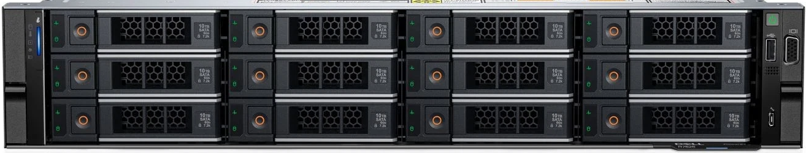
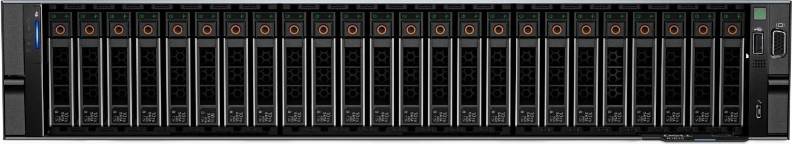
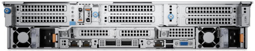

# 1.2 AHC-F2000 超融合主機

AHC-F2000 是 AcroCube 系列的 2U 機架式超融合主機。它與 AHC-F3000 的主要差異在於 AHC-F2000 安裝磁碟陣列快取模組，因此通常用於混合式儲存架構（HDD + SSD Cache）；AHC-F3000 則不具備此快取模組。其他硬體組態，例如磁碟槽位與 PCIe 網路擴充卡，則依採購規格而異。

> **重要：** 快取模組是混合式儲存架構的一部分。更換、拔除或維護資料磁碟與快取模組前，必須先依 AcroFlex 儲存維護程序確認影響範圍，切勿只依前面板燈號直接操作。

## AHC-F2000 與 AHC-F3000 的主要差異

| 項目 | AHC-F2000 | AHC-F3000 |
| --- | --- | --- |
| 機箱規格 | 2U AcroCube 超融合主機。 | 2U AcroCube 超融合主機。 |
| 磁碟陣列快取模組 | 配置快取模組，可用於 HDD + SSD Cache 的混合式儲存架構。 | 不配置磁碟陣列快取模組。 |
| 儲存維護重點 | 除資料磁碟外，尚須依程序管理與維護快取模組。 | 依資料磁碟組態與維護程序處理。 |

> **提醒：** 上表僅說明本章綱要定義的主要差異。實際磁碟、快取模組、處理器、記憶體、電源與網路組態，仍應以採購規格、主機標籤及出貨文件為準。

## 主機外觀

AHC-F2000 的前面板提供資料磁碟槽、系統控制與狀態區、前置維護介面及機架把手。依訂購組態，可採用 3.5 吋 12-bay、2.5 吋 24-bay 或 2.5 吋 16-bay 的磁碟槽配置；下列圖片展示 12-bay 與 24-bay 前面板範例。

後面板配置備援電源供應器、散熱模組、I/O／管理連接埠及 PCIe 擴充卡插槽。實際可見的網路連接埠與快取模組配置會隨已安裝硬體而不同。

## 主機組態重點

| 項目 | 說明 |
| --- | --- |
| 機箱規格 | 2U 機架式 AcroCube 超融合主機。 |
| 磁碟陣列快取模組 | 配置快取模組，通常搭配資料磁碟建立 HDD + SSD Cache 的混合式儲存架構。快取模組的實際數量、容量與介面依出貨組態而異。 |
| 磁碟槽位變體 | 可依組態提供 3.5 吋 12-bay、2.5 吋 24-bay 或 2.5 吋 16-bay 的配置。 |
| PCIe 擴充 | 可利用 PCIe 擴充槽安裝多張網路卡，實際數量受主機出貨組態與擴充卡規格影響。 |
| 網路介面選項 | 可採用 1Gbps RJ45、10Gbps RJ45、10Gbps SFP+ 光纖、25Gbps SFP28 光纖或 100Gbps QSFP28 光纖等網路卡。 |
| 電源供應器選項 | 可配置 1,100W 或 1,400W 的 1+1 熱備援電源供應器，規格與 AHC-F3000 相同。 |
| 供電設計原則 | 兩組電源供應器應分接至獨立供電迴路；任一迴路或電源供應器故障時，另一迴路必須能獨立支撐整台主機的完整負載。 |

## 前面板功能

| 區域 | 功能說明 |
| --- | --- |
| 資料磁碟槽 | 安裝混合式儲存架構中的資料磁碟。各槽位指示燈可協助辨識活動與異常狀態，但不應單獨作為拔除或更換磁碟的依據。 |
| 系統控制與狀態區 | 提供電源控制、系統識別及狀態指示功能；實際燈號定義請以機身標示與出貨文件為準。 |
| 前置維護介面 | 提供現場維護時使用的 USB 與影像服務介面。正常運作期間不建議插拔非必要設備。 |
| 機架把手 | 用於主機安裝、抽拉與固定。抽拉或搬運時，須確認滑軌已正確安裝並由足夠人力支撐設備重量。 |

## 快取模組與混合式儲存架構

AHC-F2000 的磁碟陣列快取模組可與 HDD 資料磁碟搭配使用，形成 HDD + SSD Cache 的混合式儲存架構。快取模組用於協助提升儲存存取效能；實際快取行為、快取磁碟規格與 RAID／儲存設定，應依 AcroFlex 系統設定及出貨規格確認。

在維護快取模組前，請先確認：

1. 已在 AcroFlex 管理介面辨識正確的故障元件與實體插槽。
2. 已確認相關儲存服務、RAID 與工作負載的影響範圍。
3. 已依原廠建議與維護程序完成必要的保護、備份或服務處理。
4. 未將快取模組誤認為一般未使用的資料磁碟。

## 後面板與網路擴充

| 區域 | 功能說明 |
| --- | --- |
| 備援電源供應器 | 後面板配置兩組電源供應器，提供備援電力。兩組電源應分別連接至不同的電源迴路或 UPS。 |
| 散熱模組 | 負責主機排風與溫度控制。應保持進、出風口暢通，不要遮擋或在未關機狀態下任意拆卸散熱元件。 |
| I/O 與管理連接埠 | 提供管理、網路及維護用連接埠。接線前應依機身標籤、實際網路卡與網路規劃確認用途。 |
| PCIe 擴充卡插槽 | 可安裝多張網路介面卡，提供不同速率與介面的網路連線。新增或更換擴充卡前，應確認相容性與維護安排。 |

## 供電規劃

AHC-F2000 可配置 1,100W 或 1,400W 的 1+1 熱備援電源供應器，與 AHC-F3000 的電源供應器規格相同。1+1 不表示兩條供電迴路各自只需承擔一半負載；為維持單一路電源異常時的可用性，**每一條供電迴路都必須能獨立提供整台主機的完整額定負載**。

下表以電源供應器額定功率加上 20% 容量餘裕計算，作為每台主機、每一條供電迴路的規劃參考。電流值以 `功率 ÷ 電壓` 估算，未納入實際電源效率、功率因數或其他同迴路設備負載。

| 電源供應器配置 | 每迴路最低額定功率 | 每迴路規劃功率（含 20% 餘裕） | 110V 供電參考電流 | 220V 供電參考電流 |
| --- | ---: | ---: | ---: | ---: |
| 1,100W，1+1 熱備援 | 1.10kW | 1.32kW | 約 10A；含餘裕約 12A | 約 5A；含餘裕約 6A |
| 1,400W，1+1 熱備援 | 1.40kW | 1.68kW | 約 12.7A；含餘裕約 15.3A | 約 6.4A；含餘裕約 7.6A |

### 雙迴路接法

電源供應器 A 應接至迴路／UPS／PDU A；電源供應器 B 應接至獨立的迴路／UPS／PDU B。兩者不得共用同一斷路器、同一 UPS，或同一 PDU 的單一上游電源。若任一路設備失效，另一迴路仍須可維持主機運作。

### 機房電力規劃建議

- 規劃 110V 供電時，1,100W 組態每迴路約需 12A 的規劃容量；1,400W 組態每迴路約需 15.3A。應依迴路的連續負載限制、其他設備負載及電源銘牌額定值選擇足夠容量的專用迴路。
- 規劃 220V 供電時，1,100W 組態每迴路約需 6A；1,400W 組態每迴路約需 7.6A 的規劃容量。同樣應一併納入 UPS、PDU、網路設備及其他同迴路負載。
- 有 `N` 台同型主機時，每一供電迴路可先以 `N × 每台每迴路規劃功率` 估算，再加上網路設備、儲存設備與其他負載的容量。

> **電力安全提醒：** 1,100W 與 1,400W 是電源供應器額定功率，不等同於所有組態下的實際輸入功率。最終的斷路器、插座、UPS 與 PDU 規格，必須以電源供應器銘牌的輸入額定值、實際硬體組態、當地電氣規範及合格電氣人員評估為準。

## 安裝與接線建議

1. 將主機固定於合適的機架與滑軌後，再進行資料磁碟、快取模組、電源與網路接線確認。
2. 依實際網路卡與網路規劃，標示管理、儲存、叢集及其他用途的網路纜線，避免誤接。
3. 兩組電源供應器應分接至獨立且具保護機制的 UPS、PDU 或供電迴路，使任一路電力異常時，另一路仍可供電。
4. 初次開機前，確認資料磁碟、快取模組、電源模組、網路線與其他可插拔元件均已牢靠裝妥。

## 注意事項

- 快取模組為混合式儲存架構的一部分，未依程序拔除或更換可能影響資料與服務可用性。
- 不要僅依前面板燈號判斷要處理的磁碟或快取模組；應先在管理介面核對元件、插槽與狀態。
- 網路介面類型與速率依出貨組態不同；不要假設所有機器均配置相同的網路卡。
- 兩組電源不應共用同一斷路器、同一 UPS 或單一 PDU 上游電源，以維持備援效果。
- 電源供應器額定功率與實際輸入電力需求可能不同；機房電力規劃不得只以公式估算取代銘牌與電氣安全檢查。
- 實際支援的元件、快取組態、插槽與相容性，應以採購規格、出貨文件及 AcroRed 原廠建議為準。
