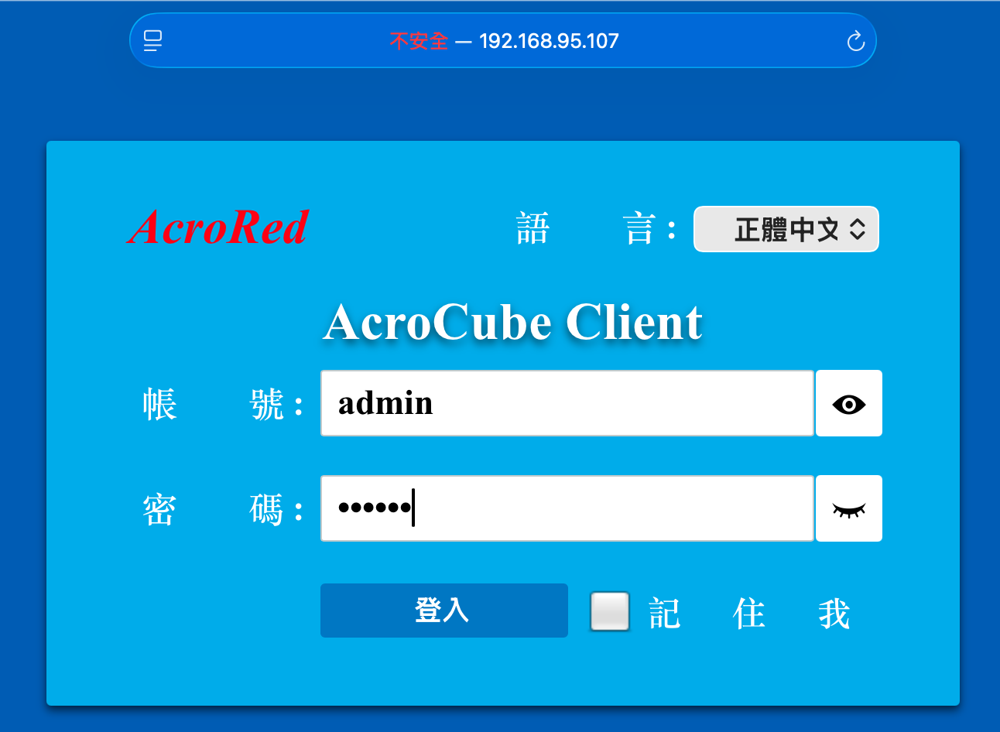

# 2.1. 登入 AcroCube 管理頁面

AcroCube 的管理介面名稱為 **AcroCube Client**。完成硬體安裝並啟動主機後，可透過管理網路登入介面，進行主機初始化與後續管理。

## 前置條件

- 已完成 AcroCube 主機的電源、網路與磁碟安裝。
- 主機已開機完成，且管理電腦可連線至 AcroCube 的管理網路。
- 具備 AcroCube 管理帳號。出廠預設管理帳號為 `admin`，預設密碼為 `000000`。
- 若尚未變更網路設定，AcroCube 出廠預設 IP 位址為 `192.168.1.88`。

> **安全性提醒：** 預設帳密只應用於首次設定。首次成功登入後，請立即依 [2.8 修改 AcroCube 管理密碼](../08-change-password/index.md) 變更 `admin` 密碼，並妥善保管新密碼。

## 登入步驟

1. 按下 AcroCube 主機的電源按鈕，等待主機完成開機。
2. 確認管理電腦與 AcroCube 管理網路連通。可在管理電腦執行下列指令確認是否收到回應：

   ```text
   ping 192.168.1.88
   ```

   若主機已改用其他 IP 位址，請將指令中的位址改為該主機目前的管理 IP。
3. 開啟瀏覽器，在網址列輸入下列網址後按 Enter：

   ```text
   https://192.168.1.88
   ```

   若 IP 位址已變更，請以 `https://<AcroCube 管理 IP>` 取代。
4. 若瀏覽器顯示憑證或安全性警告，請先確認網址為預期的 AcroCube 管理 IP，且目前使用受信任的管理網路；再依組織的憑證管理政策繼續連線。
5. 在 AcroCube Client 登入畫面中輸入帳號 `admin` 與密碼。
6. 按一下 **登入**。
7. 成功登入後，即可看到 AcroCube Client 管理介面，並可繼續進行網路、磁碟陣列及叢集等初始化設定。

## 登入畫面



圖 2.1-1　AcroCube Client 登入畫面。畫面中的 IP 位址僅為範例，實際登入時請使用目標主機的管理 IP。

## 注意事項

- 請使用 `https://` 存取管理介面，避免在不受信任的網路傳送管理帳密。
- 若 `ping` 無回應，請先確認主機已完成開機、網路線已連接、管理電腦與主機位於可互通的網段，以及 IP 位址是否已被變更。
- 除非使用個人專屬且受管理的裝置，否則不建議勾選登入畫面的「記住我」。
- 請勿在公開或非受管控的電腦上儲存 AcroCube 管理帳號與密碼。
