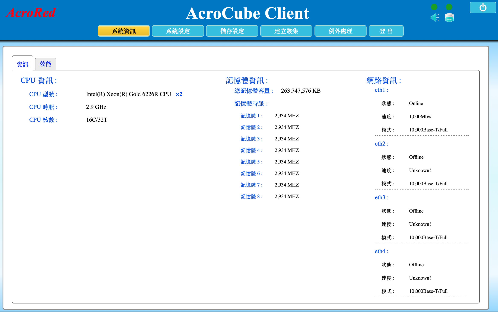

---

number: "2.2"
title: "管理頁面和系統資訊說明"
status: published
source: index.md
---

# 2.2. 管理頁面和系統資訊說明

使用者登入 **AcroCube Client** 後，系統會先顯示「系統資訊」頁面。此頁面用於快速確認主機的處理器、記憶體與網路介面狀態，是進行網路設定、建立磁碟陣列或建立叢集前的重要檢查畫面。

> **適用範圍：** 本節以圖 2.2-1 的畫面說明欄位用途。畫面中的硬體型號、容量、介面數量與數值為範例；實際顯示內容會依 AcroCube 機型與安裝組態而異。

## 開啟系統資訊頁面

1. 依 [2.1 登入 AcroCube 管理頁面](../01-login/content.md) 登入 AcroCube Client。
2. 登入完成後，系統預設顯示「系統資訊」頁面。
3. 若已切換至其他功能，按一下頂端的 **系統資訊**，即可回到此頁面。

## 頁面功能導覽

畫面上方提供主要功能導覽列，各按鈕用途如下：

| 項目   | 說明                                |
| ---- | --------------------------------- |
| 系統資訊 | 顯示本節所述的硬體、記憶體與網路介面狀態。             |
| 系統設定 | 進入主機系統相關設定，例如網路、時間、管理介面與服務設定。     |
| 儲存設定 | 進入磁碟、磁碟陣列、快取及磁碟監控等儲存設定。           |
| 建立叢集 | 用於建立或設定 AcroFlex 主機雲／叢集。          |
| 例外處理 | 用於執行例外或維護情境所需的主機處理作業。執行前應確認其影響範圍。 |
| 登出   | 結束目前登入工作階段。                       |

右上角另有狀態指示與快速操作圖示。圖示顏色可協助快速辨識目前狀態；實際圖示功能、燈號意義及可否操作仍應以介面提示、系統版本與相關章節說明為準。

## 資訊與效能頁籤

「系統資訊」頁面包含兩個頁籤：

- **資訊**：顯示本節的 CPU、記憶體與網路介面即時辨識資訊。
- **效能**：用於檢視主機效能相關資訊。本截圖未顯示該頁籤內容，因此實際圖表與欄位應以系統畫面為準。

初始化時應先在「資訊」頁籤核對硬體與網路連線是否符合規劃；完成後再依需要至各設定頁面進行後續操作。

## CPU 資訊

CPU 資訊區位於畫面左側，提供下列內容：

| 欄位     | 畫面範例                                 | 說明                                                                                                 |
| ------ | ------------------------------------ | -------------------------------------------------------------------------------------------------- |
| CPU 型號 | `Intel(R) Xeon(R) Gold 6226R CPU ×2` | 顯示偵測到的處理器型號與安裝數量。範例表示主機安裝兩顆 Intel Xeon Gold 6226R 處理器。實際型號應與採購或出貨規格相符。                             |
| CPU 時脈 | `2.9 GHz`                            | 顯示處理器時脈資訊。時脈會受處理器型號、電源管理與工作負載影響，不能單獨作為效能判斷依據。                                                      |
| CPU 核數 | `16C/32T`                            | `C` 代表實體核心（Core），`T` 代表執行緒（Thread）。此數值通常是單顆處理器的核心／執行緒規格；若畫面同時顯示兩顆 CPU，主機可用的總核心與總執行緒數仍應以系統實際辨識結果為準。 |

> **核對建議：** 若 CPU 型號、數量或核心資訊與設備規格不一致，請先停止後續部署，確認硬體安裝、BIOS 設定及出貨組態。

## 記憶體資訊

記憶體資訊區位於畫面中央，顯示主機可辨識的總記憶體容量與各記憶體模組的時脈。

| 欄位      | 畫面範例             | 說明                                                                          |
| ------- | ---------------- | --------------------------------------------------------------------------- |
| 總記憶體容量  | `263,747,576 KB` | 顯示作業系統可辨識的總記憶體容量。此範例約為 251.5 GiB；與記憶體模組標示容量略有差異時，可能與單位換算或系統保留記憶體有關。         |
| 記憶體 1～8 | `2,934 MHz`      | 顯示各已辨識記憶體模組的時脈。範例中有 8 個模組皆顯示相同時脈；若部分插槽未顯示、時脈不同或容量不足，應檢查模組安裝位置、相容性與 BIOS 設定。 |

記憶體容量與模組配置會影響 AcroFlex 可配置的工作負載資源。建立叢集前，請確認總容量符合規劃，且沒有未預期的模組遺失或降速情況。

## 網路資訊

網路資訊區位於畫面右側，以 `eth1`、`eth2`、`eth3`、`eth4` 等介面名稱分別顯示連線資訊。

| 欄位   | 說明                                                                            |
| ---- | ----------------------------------------------------------------------------- |
| 介面名稱 | 作業系統辨識的網路介面名稱，例如 `eth1`。實際用途應依網路規劃標示為管理、儲存、叢集或其他網路。                           |
| 狀態   | `Online` 表示介面目前偵測到連線；`Offline` 表示未偵測到連線。未接線的介面顯示 `Offline` 屬常見情況。             |
| 速度   | 顯示目前偵測或協商的連線速率，例如 `1,000Mb/s`。`Unknown!` 表示系統無法取得有效速度資訊，常見於未連線、未完成協商或介面設定異常時。 |
| 模式   | 顯示介面模式，例如 `10,000Base-T/Full`。`Full` 表示全雙工模式。此欄位應與實際網路卡、交換器埠與纜線規格共同判讀。        |

圖 2.2-1 中，`eth1` 顯示為 `Online`，速度為 `1,000Mb/s`；`eth2`、`eth3` 與 `eth4` 顯示為 `Offline`，速度為 `Unknown!`。若未使用這些介面，可先維持離線狀態；若規劃中應使用它們，請確認纜線、交換器埠、VLAN 與介面設定。

> **重要：** 圖中 `eth1` 的速度為 `1,000Mb/s`，但模式欄位顯示 `10,000Base-T/Full`。兩者應進一步核對，不能直接假設連線已符合 10GbE 規劃。請檢查網路卡規格、纜線類型、交換器埠速率／自動協商設定，以及 [2.3 設定網路](../03-network-settings/index.md) 的介面設定。

## 初始化前檢查清單

在繼續設定網路或儲存前，建議確認下列事項：

- CPU 型號、處理器數量與記憶體總容量符合主機規格。
- 所有已安裝的記憶體模組皆被辨識，且時脈沒有異常差異。
- 規劃使用的網路介面為 `Online`，且速度與網路設計相符。
- 未使用的介面已在網路規劃文件中標示，避免後續接線混淆。
- 畫面中的主機、網路與硬體資訊未包含需對外公開的敏感資料。

## 系統資訊畫面

圖 2.2-1　AcroCube Client「系統資訊」頁面範例。
