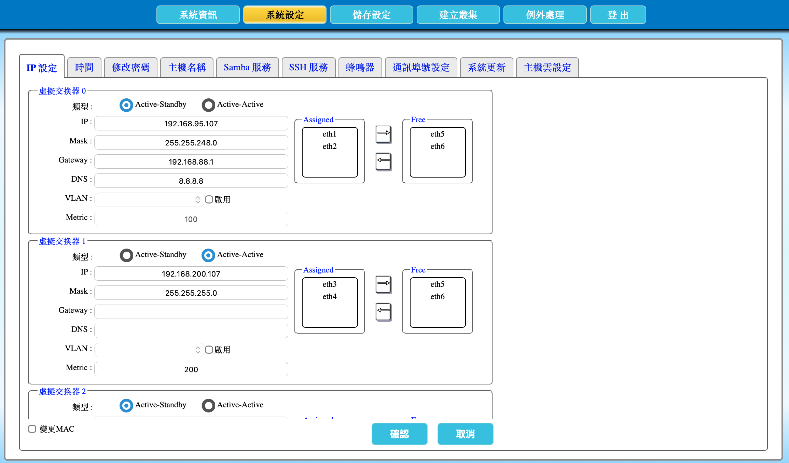

---

number: "2.3"
title: "設定網路"
status: published
source: index.md
---

# 2.3. 設定網路

本節說明如何在 AcroCube Client 設定建立 AcroFlex 超融合系統所需的基本網路。初始化階段應先完成管理網路，並依主機雲規模與儲存流量規劃決定是否另建 AcroSAN 專用網路。完成 AcroFlex 系統建立後，仍可依實際環境再進行更詳細的網路調整。

> **重要：** 儲存設定後，AcroCube 會重新開機才會套用新網路設定。請安排維護時段，確認新的管理 IP、交換器設定及登入方式後再按下「確認」。

## 前置條件

開始前，請準備下列資訊：

1. AcroCube 管理網路的 IP 位址、網路遮罩、閘道與 DNS。
2. 若使用 VLAN，請準備 VLAN ID，並確認交換器埠已完成相同的 VLAN 設定。
3. 每個虛擬交換機要使用的實體網路埠與連接的交換器埠。
4. 若規劃兩台以上的 AcroCube 組成主機雲，建議額外準備一個獨立的 AcroSAN 網路。該網路不得與管理網路使用相同 IP 網段。
5. 可用於重新登入的管理電腦；重開機後需改用新 IP 位址重新連線。

## 網路規劃範例

下列範例對應圖 2.3-1 的概念，用於說明管理網路與 AcroSAN 網路分流；實際 IP 位址、遮罩與埠號應依客戶網路規劃調整。

| 用途            | 虛擬交換機   | 範例 IP／遮罩                          | 閘道與 DNS                         | 實體埠           | Metric |
| ------------- | ------- | --------------------------------- | ------------------------------- | ------------- | ------ |
| AcroCube 管理網路 | 虛擬交換機 0 | `192.168.95.107`／`255.255.248.0`  | 閘道 `192.168.88.1`；DNS `8.8.8.8` | `eth1`、`eth2` | `100`  |
| AcroSAN 專用網路  | 虛擬交換機 1 | `192.168.200.107`／`255.255.255.0` | 可留白                             | `eth3`、`eth4` | `200`  |

管理網路通常需要預設閘道，才能讓管理者從其他網段連線，或存取外部服務。若主機需要名稱解析、對外服務或加入 AD，也應設定 DNS。AcroSAN 專用網路若只在同一儲存網段內交換資料，通常不設定預設閘道與 DNS，以避免儲存流量經由管理網路或外部路由傳遞。

## 開啟 IP 設定頁面

1. 登入 AcroCube Client。
2. 在上方功能列按一下 **系統設定**。
3. 在系統設定頁面選取 **IP 設定**。
4. 畫面會列出「虛擬交換機 0」、「虛擬交換機 1」及其他可設定的虛擬交換機區塊。

## 畫面欄位說明

每個虛擬交換機區塊都有相同的設定欄位：

| 欄位       | 說明                                            |
| -------- | --------------------------------------------- |
| 類型       | 選擇實體埠綁定方式：`Active-Standby` 或 `Active-Active`。 |
| IP       | 指派給該虛擬交換機的 IPv4 位址。每個已啟用虛擬交換機都必須使用不同網段。       |
| Mask     | 網路遮罩，用於決定該 IP 所屬的網段範圍。                        |
| Gateway  | 預設閘道；當需要連線至其他網段或外部網路時設定。僅本地網段使用的專用儲存網路可留白。    |
| DNS      | 網域名稱伺服器；需要名稱解析、外部服務或加入 AD 時設定。                |
| VLAN     | 勾選「啟用」後輸入 VLAN ID。交換器連接埠必須同時設定為可傳遞該 VLAN 的模式。 |
| Metric   | 路由優先順序。數值越小，該虛擬交換機的預設閘道優先權越高。                 |
| Assigned | 已指派給此虛擬交換機的實體網路埠。清單至少要有一個埠，虛擬交換機才會啟用。         |
| Free     | 尚未指派給目前虛擬交換機的可用實體網路埠。                         |
| 箭頭按鈕     | 將選取的實體埠在 `Free` 與 `Assigned` 之間移動。            |

## 指派實體網路埠

1. 在虛擬交換機的 **Free** 清單中選取要使用的實體網路埠。
2. 按一下指向 **Assigned** 的箭頭，將該埠加入此虛擬交換機。
3. 確認所需埠已顯示於 **Assigned** 清單。
4. 若要移除指派，於 **Assigned** 清單選取埠後，按一下指向 **Free** 的箭頭。

> **重要：** 虛擬交換機 0 是第一個虛擬交換機，不可停用，`Assigned` 欄位不得為空白。若移除所有埠，管理網路將無法啟用，可能導致無法登入 AcroCube Client。

## 選擇綁定類型

當一個虛擬交換機指派兩個或以上的實體網路埠時，需選擇埠綁定類型。

| 類型             | 運作方式                           | 優點                         | 注意事項                               |
| -------------- | ------------------------------ | -------------------------- | ---------------------------------- |
| Active-Standby | 一個埠提供主要連線，另一個埠待命；主要埠失效時切換至待命埠。 | 行為較單純，故障切換路徑明確，適合管理網路。     | 正常運作時通常只使用主要埠的頻寬。                  |
| Active-Active  | 多個已指派埠可同時承擔流量。                 | 可分散流量並提高整體可用頻寬，適合有足夠流量的網路。 | 單一連線不一定能取得所有埠的合計頻寬；應依實際流量與交換器環境驗證。 |

AcroCube 的 **Active-Active** 綁定不採用 LACP，因此交換器端不需要建立 LACP 或 Link Aggregation 群組。每個實體網路埠仍必須正確連接至預期的網路，且 VLAN、速率、雙工與其他交換器埠設定應保持一致。請勿因為使用 Active-Active 而在交換器上自行設定 LACP；若環境使用多台交換器，也應先依交換器架構確認冗餘與轉送行為。

## 設定虛擬交換機 IP 參數

請依下列順序設定每個要啟用的虛擬交換機：

1. 確認 **Assigned** 至少包含一個實體網路埠。
2. 選擇 `Active-Standby` 或 `Active-Active`。
3. 輸入 **IP** 位址。
4. 輸入 **Mask** 網路遮罩。
5. 若需存取其他網段或外部服務，輸入 **Gateway**。
6. 若需名稱解析、對外服務或加入 AD，輸入 **DNS**。
7. 若網路使用 VLAN，勾選 **啟用**，再輸入正確的 **VLAN ID**。
8. 輸入 **Metric**。管理網路通常應使用較小的 Metric，以確保其預設閘道優先。
9. 再次核對 IP 網段、實體埠、VLAN 與 Metric；各啟用虛擬交換機的 IP 網段不得相同。

## 儲存設定與重新登入

1. 完成所有虛擬交換機設定後，按一下畫面下方的 **確認**。
2. 系統會將設定儲存至 AcroCube，並重新開機以套用網路設定。
3. 等待主機完成開機後，將管理電腦切換至可連線新管理網路的位置。
4. 使用新的管理 IP 位址重新登入 AcroCube Client。
5. 回到 [2.2 管理頁面和系統資訊說明](../02-management-system-info/content.md)，確認規劃使用的介面為 `Online` 且速度符合設計。

## 注意事項與限制

- 網路設定錯誤可能使目前工作階段中斷，甚至造成管理電腦無法連回主機。變更前請記錄原始設定與新的 IP 規劃。
- 兩個已啟用虛擬交換機不得使用相同 IP 網段；否則路由與儲存流量可能異常。
- `Assigned` 欄位空白表示該虛擬交換機未啟用。虛擬交換機 0 例外，必須保留至少一個指派埠。
- VLAN ID 必須與交換器埠設定一致；僅在主機端啟用 VLAN 不會自動設定交換器。
- 儲存設定後必須重開機才會生效，且所有使用者需重新登入 AcroCube Client。
- 不要將截圖中的 IP、DNS、Metric 或埠指派直接套用至正式環境；請以實際網路規劃為準。

## IP 設定畫面

圖 2.3-1　AcroCube Client「IP 設定」頁面範例。
