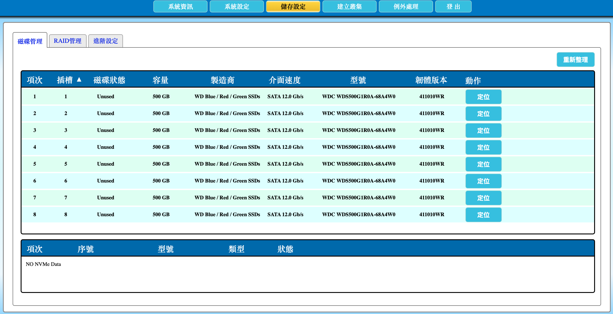
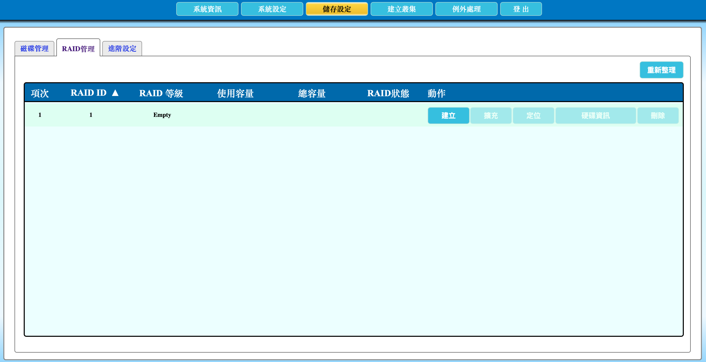
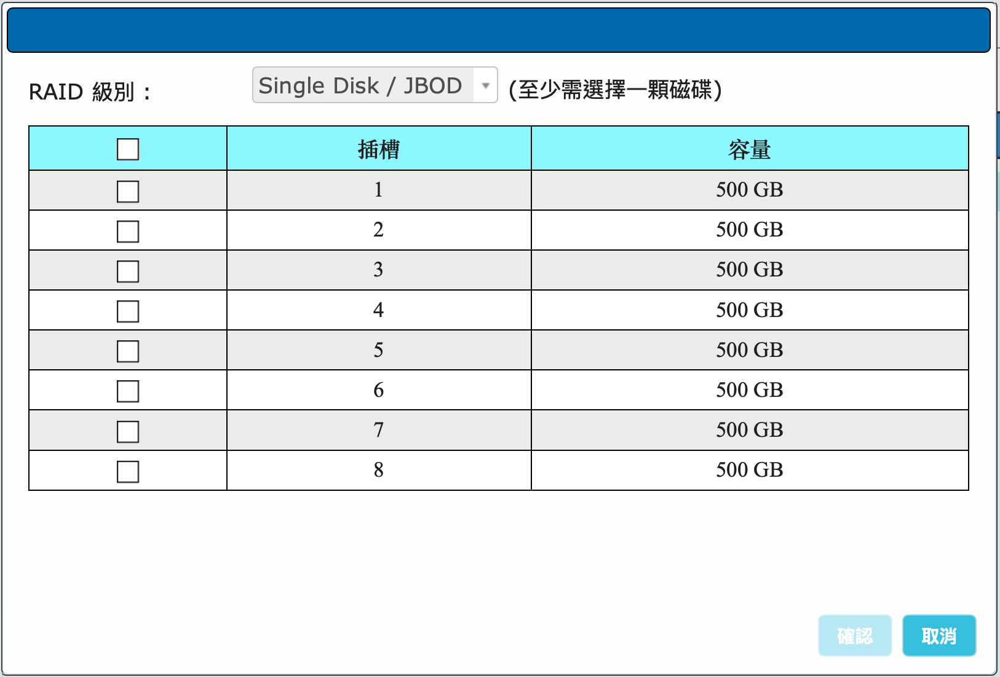
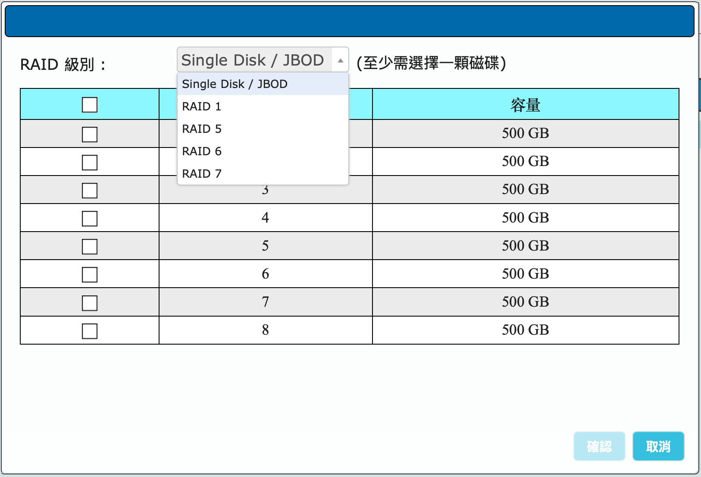
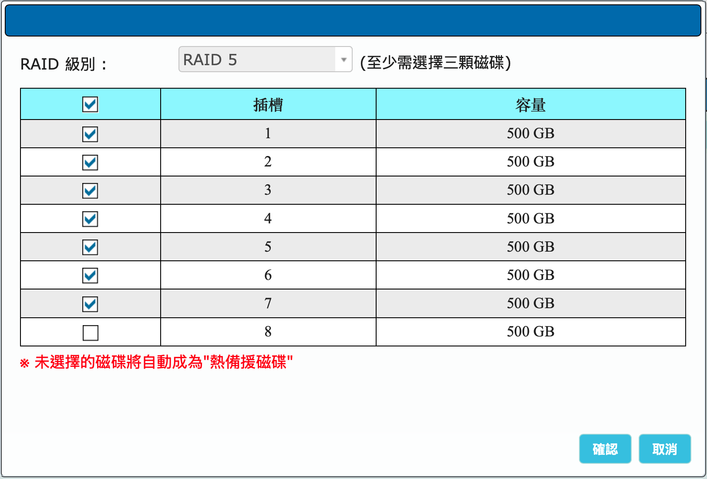
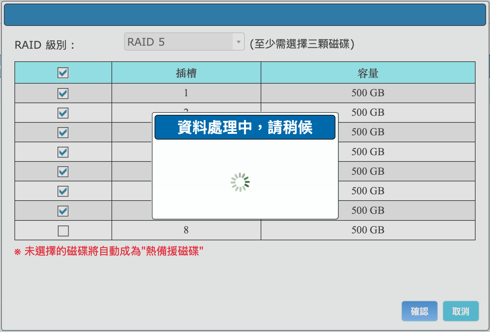
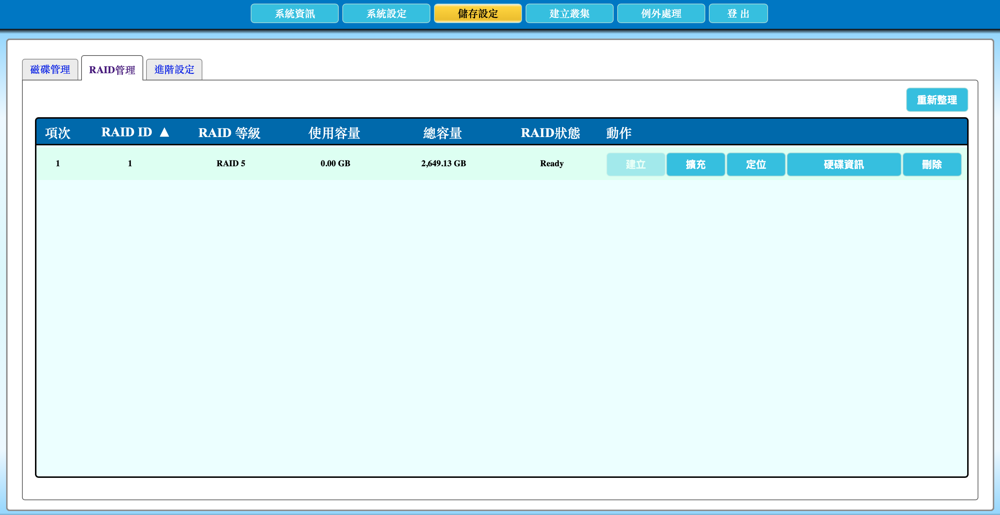
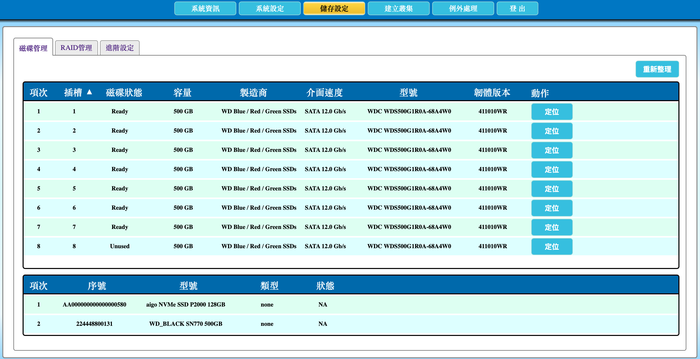

---

number: "2.4"
title: "建立磁碟陣列"
status: draft
source: index.md
---

# 2.4 建立磁碟陣列

本節說明如何在 AcroCube 主機上確認可用硬碟、建立 RAID 磁碟陣列，以及在 RAID 管理與磁碟管理頁面確認建立結果。若 AcroCube 將作為混合主機或儲存主機，請在建立或加入 AcroFlex 超融合系統前完成磁碟陣列的規劃與建立。

> **注意：** 建立或重新規劃磁碟陣列可能影響所選硬碟上的既有資料。請只選取確認可初始化的未使用硬碟；若硬碟已有資料，請先完成備份並依維運程序處理。

## 前置條件

- 已以具管理權限的帳號登入 AcroCube 管理介面。
- 已將規劃使用的硬碟正確安裝至 AcroCube 主機，且可在「磁碟管理」頁面中辨識。
- 已確認磁碟的容量、型號與介面符合部署規劃。建議同一個陣列使用容量與效能特性相近的磁碟。
- 已決定 RAID 等級、資料磁碟數量及熱備援磁碟配置；若主機已有服務或既有陣列，請先安排維護時段並確認變更影響。

## 1. 確認可用磁碟

在左側功能選單點選「**儲存設定**」，系統會開啟「磁碟管理」頁面。此頁面列出目前由主機偵測到、可供規劃使用的磁碟。

主要欄位說明如下：

| 欄位          | 說明                                                 |
| ----------- | -------------------------------------------------- |
| 項次／插槽       | 磁碟在畫面上的序號與實體插槽編號，可用於與主機前方硬碟槽位核對。                   |
| 磁碟狀態        | 顯示磁碟目前狀態；範例中的 `Unused` 表示尚未加入陣列。建立前請確認選取的磁碟皆為預期狀態。 |
| 容量          | 磁碟可用容量。RAID 的可用容量通常會受到最小成員碟容量與 RAID 等級影響。          |
| 製造商／型號／韌體版本 | 用來核對硬碟硬體資訊；若出現非預期型號或韌體，應先確認硬體配置。                   |
| 介面速度        | 顯示磁碟介面連線資訊，例如 SATA 連線速度，可協助排查磁碟連線或相容性問題。           |
| 動作：定位       | 點選後可讓對應硬碟的定位燈號亮起或閃爍，以協助現場人員確認實體插槽。操作完成後請依介面狀態結束定位。 |

畫面右上角的「**重新整理**」可重新讀取磁碟狀態。範例下方的 NVMe 區域顯示 `NO NVMe Data`，表示此範例環境未偵測到可列出的 NVMe 磁碟；這不是錯誤訊息。若實際安裝了 NVMe 磁碟卻未顯示，請先確認硬體安裝與系統偵測狀態。

### 磁碟列表欄位說明

| 欄位 | 說明 |
| --- | --- |
| 項次 | 磁碟在目前列表中的序號。 |
| 插槽 | 對應主機的實體硬碟插槽編號，可用來核對磁碟安裝位置。 |
| 磁碟狀態 | 顯示磁碟目前狀態，例如 `Unused` 表示尚未加入磁碟陣列。 |
| 容量 | 顯示該實體磁碟的容量；規劃陣列與熱備援時應一併確認。 |
| 製造商 | 顯示硬碟製造商資訊，用於核對硬體配置。 |
| 介面速度 | 顯示磁碟介面連線資訊，例如 SATA 連線速度。 |
| 型號 | 顯示硬碟型號，可用於確認是否符合採購與部署規格。 |
| 韌體版本 | 顯示硬碟目前韌體版本；若需維護或排錯，應記錄此資訊。 |
| 動作 | 提供「定位」功能，協助現場人員以定位燈號辨識實體磁碟。 |

## 2. 開啟 RAID 管理頁面

在「儲存設定」中點選「**RAID 管理**」。此頁面用於檢視與管理目前的磁碟陣列。第一次建立時，陣列清單會顯示 `Empty`，代表尚未建立可用的 RAID 陣列。

頁面上可見的功能如下：

- 「**建立**」：新增磁碟陣列。
- 「**擴充**」、「**定位**」、「**硬碟資訊**」與「**刪除**」：需先有可操作的陣列才會啟用；在尚未建立陣列時，按鈕呈現停用狀態是正常現象。
- 「**重新整理**」：重新讀取 RAID 管理狀態。

請確認目前沒有需要保留的既有陣列後，再進行建立作業。

## 3. 開啟建立磁碟陣列對話框

點選「**建立**」，系統會開啟「建立磁碟陣列」對話框。對話框包含兩個主要設定項目：

1. **RAID 級別**：選擇磁碟陣列的保護與容量配置方式。
2. **磁碟清單**：勾選要加入陣列的實體磁碟；每一列會顯示插槽與容量，應先與前一節的磁碟管理資訊核對。

系統會依選擇的 RAID 級別顯示最低磁碟數量。在尚未選擇符合條件的磁碟前，「**確認後開始建立**」無法使用。

## 4. 選擇 RAID 級別

開啟「RAID 級別」下拉選單後，可選擇 `Single Disk / JBOD`、`RAID 1`、`RAID 5`、`RAID 6` 或 `RAID 7`。請依資料保護需求、可接受的容量利用率與硬碟數量進行選擇。

下表為規劃時的通用參考；實際可選項目、最低磁碟數量與可用容量仍以管理介面及核准的產品部署規格為準。

| RAID 級別            | 一般最低磁碟數 | 特性與優點                        | 限制與規劃提醒                                 |
| ------------------ | ------- | ---------------------------- | --------------------------------------- |
| Single Disk / JBOD | 1       | 以單一磁碟使用，不需同位元校驗或鏡像，可保留單碟容量。  | 不提供 RAID 層級的容錯保護；不建議用於需要高可用資料保護的正式工作負載。 |
| RAID 1             | 2       | 以鏡像方式保存資料，具有較佳的資料冗餘。         | 可用容量約受單一成員碟容量限制；需使用更多磁碟換取保護能力。          |
| RAID 5             | 3       | 使用分散式同位元校驗，兼顧容量利用率與單一磁碟故障保護。 | 至少需要 3 顆磁碟；可承受 1 顆成員碟故障。寫入作業會有同位元校驗負擔。  |
| RAID 6             | 4       | 使用雙重同位元校驗，較適合需要較高故障容忍度的情境。   | 一般至少需要 4 顆磁碟；可用容量較 RAID 5 少，且寫入負擔通常較高。  |
| RAID 7             | 5       | ZFS專屬RAID 7                  | 三容錯。專為超高密度、大容量硬碟陣列設計，確保在多顆硬碟同時重建時仍萬無一失。 |

> **建議：** 請避免混用容量明顯不同的磁碟。陣列通常會以最小成員碟的容量為基準，較大磁碟未能使用的容量可能無法納入陣列可用空間。

## 5. 選取磁碟並建立 RAID 5

以下以 RAID 5 為例說明。先在「RAID 級別」選擇「**RAID 5**」，介面會提示「至少需選擇三顆磁碟」。接著勾選要納入陣列的磁碟；範例中勾選插槽 1 至 7 的七顆磁碟，插槽 8 則保留未選取。

請在按下確認前逐一核對：

- 已選取的磁碟數量符合 RAID 5 至少三顆的要求。
- 選取的插槽、容量及磁碟狀態均與規劃相符。
- 未選取的磁碟是否要保留作為熱備援；本介面會將未加入陣列的磁碟自動設定為「**熱備援磁碟**」。

確認無誤後，按下「**確認後開始建立**」。

範例中的紅字提示指出，沒有被選擇的磁碟將自動成為熱備援磁碟。熱備援磁碟可在成員碟故障時提供後續替補使用；其容量必須大於或等於陣列內最小成員碟的容量。因此，若要保留某顆磁碟作熱備援，請不要在此步驟勾選它，並先確認其容量符合條件。

送出建立要求後，系統會顯示「資料處理中，請稍候」。建立期間請等待作業完成，不要關閉管理頁面、重新啟動主機、拔除磁碟或變更相關儲存設定，以免中斷作業。

## 6. 確認磁碟陣列已建立

建立完成後，返回或重新整理「RAID 管理」頁面。當陣列清單顯示 RAID 級別、總容量與狀態 `Ready`，表示陣列已建立完成並可供後續部署流程使用。

範例顯示 RAID ID `1`、RAID 級別 `RAID 5`、已使用空間 `0.00 GB`、總容量 `2,649.13 GB`，狀態為 `Ready`。實際顯示容量會依成員碟數量、最小容量、RAID 等級與系統的容量換算方式而不同，請以畫面數值為準。

此時頁面的「擴充」、「定位」、「硬碟資訊」與「刪除」等功能會依陣列狀態提供操作。建立後應先確認 RAID 級別、狀態與容量均符合規劃，再繼續建立或加入 AcroFlex 超融合系統。

### 磁碟陣列列表欄位說明

| 欄位 | 說明 |
| --- | --- |
| RAID ID | 磁碟陣列的識別編號。後續查看、定位、擴充或維護時，可用此編號辨識目標陣列。 |
| RAID 級別 | 顯示陣列所使用的 RAID 保護方式，例如範例中的 `RAID 5`。應與建置規劃相符。 |
| 已使用空間 | 顯示目前已由陣列使用的容量。新建立、尚未投入使用的陣列通常顯示為 `0.00 GB`。 |
| 總容量 | 顯示建立後可供使用的陣列容量。此數值會受成員碟容量、RAID 級別與系統容量換算方式影響。 |
| 狀態 | 顯示磁碟陣列目前狀態；`Ready` 表示陣列已建立完成並可供後續部署流程使用。 |

## 7. 在磁碟管理頁面確認成員碟與熱備援碟

最後切換回「**磁碟管理**」頁面，確認各實體磁碟的狀態已依建立結果更新。範例中，插槽 1 至 7 的磁碟狀態均顯示 `Ready`，表示這些磁碟已加入並可供已建立的磁碟陣列使用；插槽 8 顯示 `Unused`，表示它沒有加入 RAID 5 陣列。

依本節建立流程，未加入陣列的 `Unused` 磁碟會自動作為熱備援磁碟。請確認保留為 `Unused` 的磁碟容量大於或等於陣列內最小成員碟容量，才能在需要時擔任替補磁碟。畫面中的「定位」按鈕可協助現場核對每一顆磁碟的實體插槽。

下方 NVMe 清單會另外列出偵測到的 NVMe 裝置及其狀態。本範例中的 NVMe 裝置類型顯示為 `none`、狀態為 `NA`；請依實際硬體規劃判讀，並以儲存部署設計為準。

## 注意事項

- 每一種 RAID 級別都有最小磁碟數量限制；若未選取足夠磁碟，「確認後開始建立」無法進行。
- 未加入陣列的磁碟會自動成為熱備援磁碟，請將此行為納入硬碟數量規劃。
- 熱備援磁碟容量必須大於或等於陣列中最小成員碟容量。
- 若主機用於混合或儲存角色，請在加入 AcroFlex 系統前完成 RAID 建立與確認，以避免後續部署流程受影響。
- 磁碟、陣列或儲存角色的變更可能影響既有資料與服務；正式環境請依變更管理程序執行。
