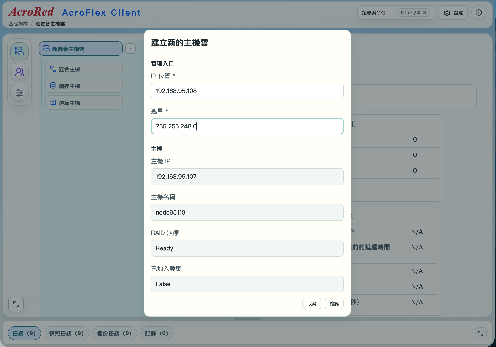

---

number: "2.5"
title: "建立叢集"
status: draft
source: index.md
---

# 2.5 建立叢集

完成 AcroCube 超融合主機初始化後，可建立 AcroFlex 超融合主機雲。主機雲的管理系統稱為 **AcroVMS**，以下簡稱 **VMS**。建立完成後，請使用獨立的 VMS 管理 IP 位址登入 AcroFlex Client，進行後續的系統管理。

> **重要：** VMS 管理 IP 必須與 AcroCube 第一個虛擬交換機使用相同網段，且必須是網路中尚未被使用的有效 IP 位址。建立前請先向網路管理人員確認 IP 配置，避免與其他設備衝突。

## 前置條件

- 已完成 AcroCube 的網路設定，並確認第一個虛擬交換機可正常使用。
- 已完成磁碟陣列建立，且 RAID 狀態為 `Ready`。
- 已準備一組供 VMS 使用的管理 IP 位址與網路遮罩。
- 已確認 VMS 管理 IP 不會與 AcroCube、閘道、交換器、其他伺服器或 DHCP 配發範圍衝突。

### VMS 管理 IP 規劃範例

假設 AcroCube 第一個虛擬交換機設定如下：

| 項目             | 範例值              |
| -------------- | ---------------- |
| AcroCube 管理 IP | `192.168.95.107` |
| 網路遮罩           | `255.255.248.0`  |
| VMS 管理 IP      | `192.168.95.108` |

遮罩 `255.255.248.0` 等同於 `/21`，其網段範圍為 `192.168.88.0/21`。因此 `192.168.95.107` 與 `192.168.95.108` 都在同一個網段內，可作為本例中的 AcroCube 與 VMS 管理位址。

相反地，若將 VMS 設為 `192.168.96.108`，此位址不屬於 `192.168.88.0/21` 網段，不能作為本例第一個虛擬交換機的 VMS 管理 IP。

## 1. 開啟建立叢集功能

在 AcroCube Client 頂端功能列點選「**建立叢集**」。此功能用於開始建立新的 AcroFlex 超融合主機雲，並設定 VMS 的管理入口。

在進入下一步前，請確認目前已完成網路與 RAID 設定。若尚未建立 RAID，應先依第 2.4 節完成磁碟陣列建立，避免主機雲建立流程無法繼續。


## 2. 檢查「建立新的主機雲」資訊

點選後會開啟「**建立新的主機雲**」對話框。請先輸入 VMS 的管理入口資訊，再檢查系統帶入的主機資訊是否正確。

| 欄位      | 說明與檢查重點                                                          |
| ------- | ---------------------------------------------------------------- |
| IP 位置   | VMS 的獨立管理 IP。必須與 AcroCube 第一個虛擬交換機位於相同網段，且不得與其他裝置重複。             |
| 遮罩      | VMS 管理 IP 所使用的網路遮罩。應與第一個虛擬交換機的遮罩一致，例如 `255.255.248.0`。           |
| 主機 IP   | 顯示即將加入主機雲的 AcroCube 管理 IP。請確認這是預期的主機。                            |
| 主機名稱    | 顯示 AcroCube 主機名稱，可作為辨識主機的參考。                                     |
| RAID 狀態 | 建立前必須顯示 `Ready`，表示磁碟陣列已完成建立並可供使用。若不是 `Ready`，請停止此流程並先處理 RAID 問題。 |
| 已加入叢集   | 新建主機雲時應顯示 `False`，表示此主機尚未加入既有叢集。                                 |

範例中，VMS IP 為 `192.168.95.108`，遮罩為 `255.255.248.0`；主機 IP 為 `192.168.95.107`，RAID 狀態為 `Ready`，已加入叢集為 `False`。這代表主機已符合建立新的主機雲所需的基本狀態。



## 3. 建立 AcroFlex 超融合主機雲

確認 VMS 管理 IP、遮罩、主機資訊與 RAID 狀態均正確後，按下「**確認**」開始建立 AcroFlex 超融合主機雲。若要放棄本次設定，請按「取消」。

建立期間請保持 AcroCube 主機與管理網路正常連線，避免重新啟動主機、拔除磁碟或變更網路與儲存設定。請等待系統完成建立流程後，再進行後續操作。

## 4. 以 VMS 管理 IP 登入 AcroFlex Client

主機雲建立完成後，請在管理電腦的瀏覽器使用新的 VMS 管理 IP 登入 AcroFlex Client。例如本節範例可使用：

```text
https://192.168.95.108
```

實際登入網址與連線方式請以系統畫面、部署規格及環境的憑證設定為準。請確認管理電腦與 VMS 管理 IP 的網路可達；若無法連線，應先檢查 VMS IP、遮罩、第一個虛擬交換機與管理網路設定。

## 注意事項

- VMS 管理 IP 必須與 AcroCube 第一個虛擬交換機位於同一網段。
- 建立叢集前，請先完成 RAID 建立，並確認 RAID 狀態為 `Ready`。
- VMS 管理 IP 必須是獨立且未被使用的位址，不可與 AcroCube 管理 IP 或其他網路設備重複。
- 螢幕快照中的 IP 位址與主機名稱僅為範例，請勿直接套用至正式環境。