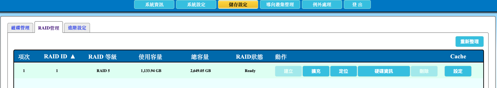
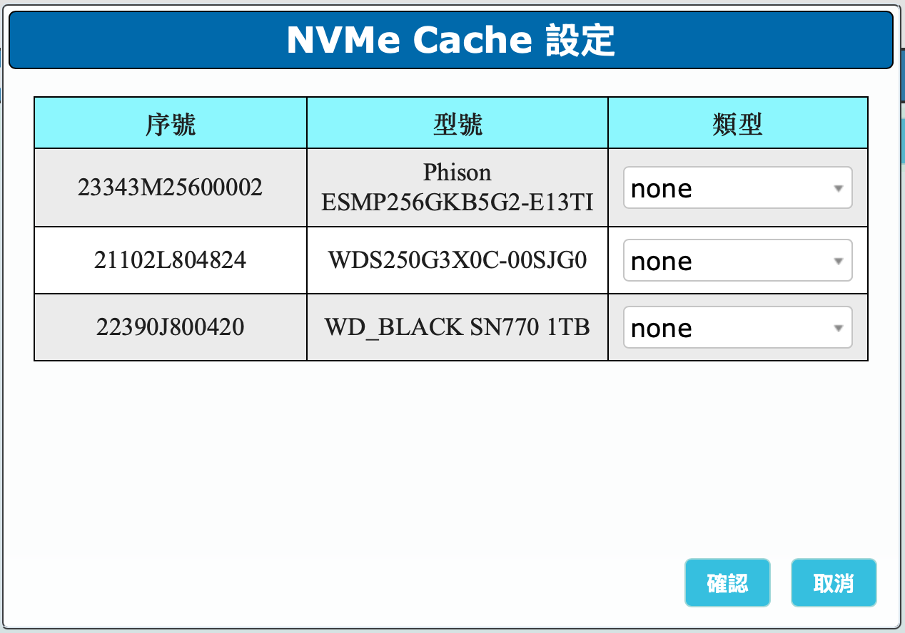
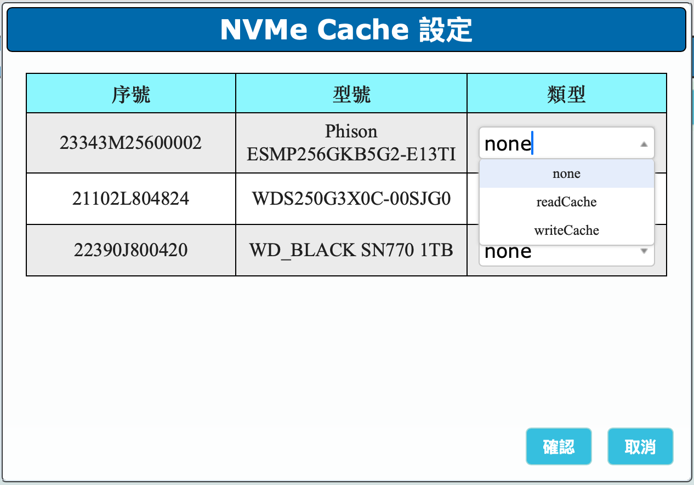
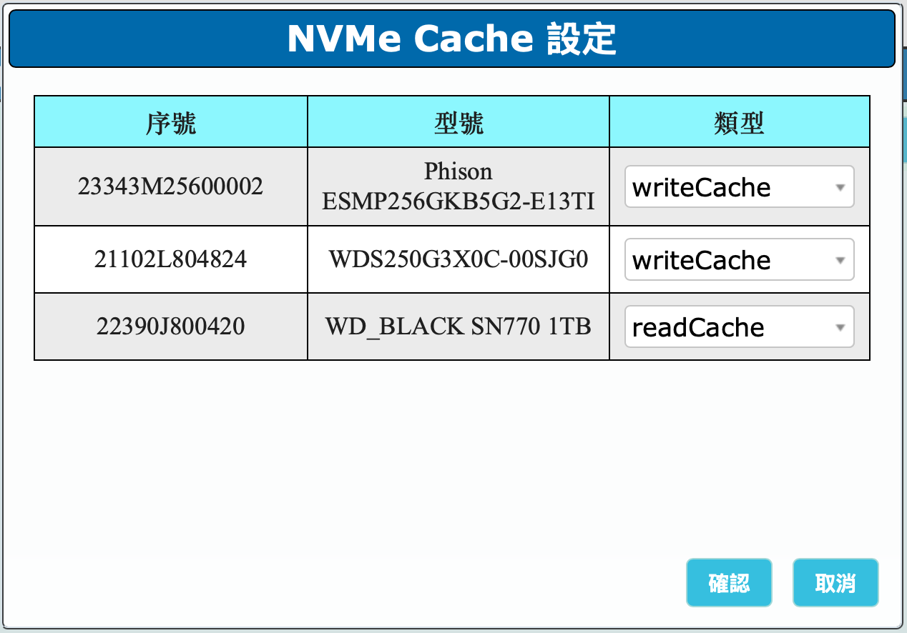

---

number: "2.6"
title: "設定快取"
status: draft
source: index.md
---

# 2.6 設定快取

本節說明如何為 AcroCube 的磁碟陣列設定 NVMe 快取裝置。快取可協助提升磁碟陣列的 I/O 存取效能；但若主機採用 All Flash 儲存組態，通常不需要額外設定快取，請依實際部署規格決定。

快取分為讀取快取（`readCache`）與寫入快取（`writeCache`）。讀取快取用於加速常用資料的讀取；寫入快取用於加速寫入處理。請先完成 RAID 建立，且確認 RAID 狀態為 `Ready`，再進行本節設定。

> **重要：** 快取設定會影響儲存 I/O 的運作方式。正式環境變更前，請確認 NVMe 裝置、RAID 狀態與維護時段；設定期間不要拔除 NVMe 裝置或變更 RAID 組態。

## 前置條件

- 採購 AcroCube 時已配置可用於快取的 NVMe 裝置。
- 已建立磁碟陣列，且 RAID 狀態為 `Ready`。
- 讀取快取至少需要 1 顆 NVMe 裝置。
- 寫入快取至少需要 1 顆 NVMe 裝置；為提升系統穩定性與資料保護能力，建議配置 2 顆寫入快取 NVMe 裝置，使其中一顆發生故障時仍有另一顆可供備援。
- 已確認主機不是依 All Flash 設計而無需額外快取的組態。

## 1. 開啟快取設定

進入「**儲存設定**」後，切換至「**RAID 管理**」頁面。在 RAID 列表最右側的 **Cache** 欄位，找到目標 RAID，並點選「**設定**」。

請先確認目標 RAID 的狀態為 `Ready`。畫面中的 RAID ID、RAID 等級、使用容量與總容量可協助確認目前操作的是預期的磁碟陣列。

## 2. 檢查 NVMe Cache 設定對話框

點選「設定」後，系統會開啟「**NVMe Cache 設定**」對話框，列出目前偵測到的 NVMe 裝置與各自的快取類型。設定前，請核對每一列裝置資訊是否符合硬體規劃。

| 欄位 | 說明                                          |
| -- | ------------------------------------------- |
| 序號 | NVMe 裝置的序號，可用於辨識特定硬碟。進行維護或故障排查時，應記錄此資訊。     |
| 型號 | NVMe 裝置型號，用於核對實際安裝的快取硬體是否符合規劃。              |
| 類型 | 用下拉選單指定該 NVMe 裝置的快取用途。初始值 `none` 表示尚未設定為快取。 |

範例中共有三顆 NVMe 裝置，類型皆為 `none`，代表尚未指派讀取或寫入快取。

## 3. 選擇 NVMe 快取類型

在每一顆 NVMe 裝置的「類型」欄位點選下拉選單，依快取規劃選擇適當類型。選單提供下列選項：

| 選項           | 說明                                                                 |
| ------------ | ------------------------------------------------------------------ |
| `none`       | 不將該 NVMe 裝置設定為快取。可保留此設定給不需參與快取的裝置。                                 |
| `readCache`  | 將該 NVMe 裝置設定為讀取快取。至少需要 1 顆 NVMe 裝置；容量應依日常讀取工作負載與常用資料量規劃。           |
| `writeCache` | 將該 NVMe 裝置設定為寫入快取。至少需要 1 顆 NVMe 裝置；正式環境建議使用 2 顆，以提高單顆裝置故障時的保護與可用性。 |

設定時，應避免將所有 NVMe 裝置都指派為同一用途而忽略實際工作負載需求。讀取工作負載較大時，可增加讀取快取容量；寫入快取則應優先考量備援配置。若讀取快取裝置損壞，通常不會直接造成資料安全問題，但讀取效能可能下降；寫入快取裝置則建議採兩顆配置。

範例中，前兩顆 NVMe 設為 `writeCache`，第三顆 NVMe 設為 `readCache`，符合兩顆寫入快取加一顆讀取快取的規劃方式。

## 4. 儲存快取設定

再次確認每一顆 NVMe 裝置的序號、型號與快取類型均正確後，按下「**確認**」儲存快取設定；若不套用本次變更，請按「取消」。

完成後，建議回到 RAID 管理頁面，確認目標 RAID 仍為 `Ready`，並依實際工作負載觀察 I/O 效能與系統告警狀態。

## 注意事項

- All Flash 組態通常不需要額外設定快取；請依採購規格與部署設計為準。
- 讀取快取至少需 1 顆 NVMe 裝置；讀取快取容量應依常用資料量與日常使用量規劃。
- 寫入快取至少需 1 顆 NVMe 裝置，正式環境建議使用 2 顆，以提高裝置故障時的安全性與可用性。
- 讀取快取裝置損壞通常不會直接造成資料安全問題，但可能影響讀取效能。
- 變更快取設定前，請先確認 RAID 已建立完成且狀態為 `Ready`。