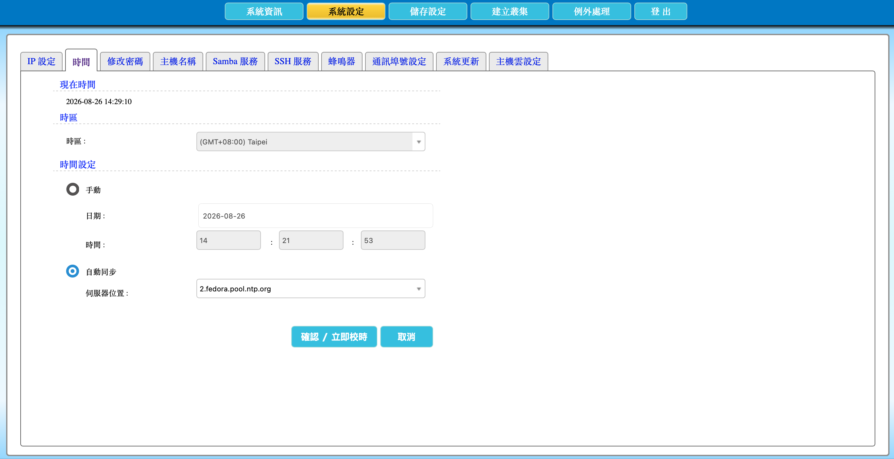

---

number: "2.7"
title: "設定時間和校時"
status: draft
source: index.md
---

# 2.7 設定時間和校時

本節說明如何設定 AcroCube 超融合主機的系統時間、時區與自動校時。正確且一致的時間可協助管理者比對系統記錄、事件與告警；建議使用可信任的 NTP 校時來源，讓主機持續自動同步時間。

## 時間設定畫面說明

在頂端功能列點選「**系統設定**」，再選擇「**時間**」頁籤，即可進入時間設定畫面。畫面包含下列項目：

| 項目      | 說明                                                       |
| ------- | -------------------------------------------------------- |
| 現在時間    | 顯示 AcroCube 目前的系統日期與時間，可用來初步確認時間是否明顯異常。                  |
| 時區      | 選擇主機所在地或組織規範使用的時區。時區會影響畫面與系統記錄顯示的本地時間。                   |
| 手動      | 選取後可自行輸入日期及時、分、秒；適用於無法連線 NTP 或需暫時手動設定的環境。                |
| 日期／時間   | 手動模式下用來輸入系統時間。日期格式為年、月、日，時間分別輸入時、分、秒。                    |
| 自動同步    | 選取後由指定的 NTP 伺服器校正系統時間，建議正式環境使用此方式。                       |
| 伺服器位置   | 輸入或選擇 NTP 伺服器的主機名稱或 IP 位址。若使用主機名稱，AcroCube 必須能透過 DNS 解析。 |
| 確認／立即校時 | 儲存本次設定，並立即嘗試與指定的 NTP 伺服器校時。                              |
| 取消      | 放棄尚未儲存的變更。                                               |

範例畫面顯示時區為 `(GMT+08:00) Taipei`，並啟用「自動同步」，NTP 伺服器為 `2.fedora.pool.ntp.org`。畫面中的日期、時間與 NTP 主機名稱僅為範例，請依實際環境設定。



## 前置條件

- 已以具管理權限的帳號登入 AcroCube Client。
- 若使用外部 NTP 伺服器，已確認 AcroCube 可透過管理網路對外通訊。
- 若以 NTP 主機名稱設定伺服器，已在 IP 設定中正確設定 Gateway 與 DNS，且 DNS 可解析該名稱。
- 防火牆、路由器及網路安全設備已允許 AcroCube 與 NTP 伺服器之間的 NTP 通訊。NTP 預設使用 UDP 連接埠 `123`。
- 已依所在地與組織的時間標準決定正確時區與 NTP 來源；若環境無法連外，可使用組織內部的 NTP 伺服器。

## 1. 確認 NTP 連線條件

使用自動同步前，先確認主機可連線至指定的 NTP 來源。若使用外部 NTP 服務，請確認管理網路的 Gateway、DNS 與防火牆規則已設定完成；若使用內部 NTP 服務，請確認 AcroCube 與 NTP 伺服器之間的網路路由及 UDP `123` 通訊未被阻擋。

若伺服器位置填入網域名稱，例如 `ntp.example.com`，DNS 設定必須正確。若 DNS 尚未配置或名稱無法解析，可改用經核准的 NTP 伺服器 IP 位址，並依組織的網路規範處理。

## 2. 設定時區

在「時區」下拉選單選擇主機所在地或組織統一使用的時區。例如主機位於臺灣時，可選擇：

```text
(GMT+08:00) Taipei
```

時區應與系統管理、事件記錄與維運團隊使用的時間標準一致。變更時區不等同於校正目前系統時間；完成時區選擇後，仍應設定自動同步或手動輸入正確時間。

## 3. 選擇自動同步或手動設定時間

### 使用自動同步（建議）

選擇「**自動同步**」，再於「伺服器位置」輸入或選擇 NTP 伺服器名稱或 IP 位址。例如可使用組織內部的 NTP 伺服器，或經核准的外部 NTP 來源。

自動同步可持續校正系統時間，較適合正式環境。多台 AcroCube 主機屬於同一管理環境時，建議使用一致且可信任的時間來源。

### 使用手動設定

若環境暫時無法使用 NTP，選擇「**手動**」，輸入正確日期與時間。手動設定後，系統時間可能隨時間逐漸產生偏差；網路與 NTP 服務恢復後，建議改回自動同步。

## 4. 儲存並立即校時

完成時區與時間來源設定後，按下「**確認／立即校時**」。系統會儲存設定，並立即嘗試與指定的 NTP 伺服器同步時間。

完成後，請查看「現在時間」是否符合預期。若時間未更新或同步失敗，請依序檢查：

1. NTP 伺服器名稱或 IP 位址是否正確。
2. DNS 是否能解析 NTP 主機名稱。
3. Gateway、路由與防火牆是否允許 UDP `123` 通訊。
4. 選取的時區是否正確。

## 注意事項

- 建議使用自動同步，避免長期手動校時造成時間偏差。
- 同一 AcroFlex 環境內的主機應使用一致且可信任的時間來源與時區設定。
- 外部 NTP 服務需要可用的 Gateway、DNS 與防火牆規則；無法連外的環境應使用內部 NTP 伺服器。
- 時間、時區或 NTP 來源變更後，應確認系統記錄的時間顯示是否符合維運標準。