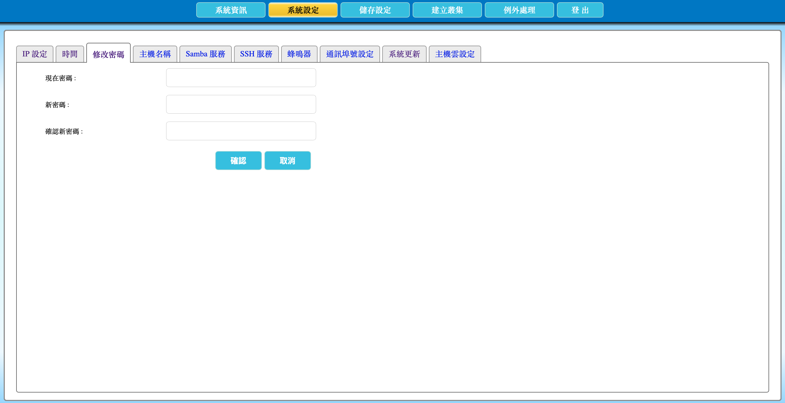

# 2.8 修改 AcroCube 管理密碼

本節說明如何修改 AcroCube Client 的 `admin` 管理帳號密碼。首次登入、交接管理權限或依組織資安政策進行例行變更後，都應使用新的密碼登入並妥善保存。

> **安全性提醒：** 請勿在操作畫面、文件、聊天訊息或未受保護的檔案中記錄實際密碼。變更前請確認授權管理者能安全取得新密碼，以免造成管理介面無法登入。

## 修改密碼畫面說明

在頂端功能列點選「**系統設定**」，再選擇「**修改密碼**」頁籤，即可開啟密碼修改畫面。畫面提供三個密碼欄位及確認、取消按鈕：

| 項目 | 說明 |
| --- | --- |
| 現在密碼 | 輸入目前 `admin` 帳號正在使用的密碼，用來驗證本次修改授權。 |
| 新密碼 | 輸入要設定的新密碼。請依組織的密碼長度、複雜度與保存政策建立密碼。 |
| 確認新密碼 | 再輸入一次相同的新密碼，避免因輸入錯誤導致設定非預期密碼。 |
| 確認 | 驗證欄位內容並儲存新的管理密碼。 |
| 取消 | 放棄本次尚未儲存的變更。 |

## 前置條件

- 已以具管理權限的 `admin` 帳號登入 AcroCube Client。
- 已取得目前的 `admin` 密碼。
- 已準備符合組織資安規範的新密碼，並有安全的方式交付或保存給獲授權的管理者。

## 修改密碼步驟

1. 在「現在密碼」欄位輸入目前 `admin` 帳號的密碼。
2. 在「新密碼」欄位輸入新密碼。
3. 在「確認新密碼」欄位再次輸入相同的新密碼。兩次輸入必須完全一致。
4. 確認輸入內容無誤後，按下「**確認**」儲存新密碼。
5. 以新的密碼重新登入或於下一次登入時驗證新密碼是否可正常使用。

若不想套用本次變更，請按「取消」。若系統拒絕儲存，請先確認現在密碼正確、兩次新密碼完全相同，並依畫面提示檢查是否有不符合系統或組織密碼規範的情況。

## 密碼管理建議

- 使用長度足夠且不易猜測的獨特密碼，避免使用設備名稱、使用者名稱、生日或連續字元。
- 不要重複使用其他系統、雲端服務或個人帳號的密碼。
- 將密碼存放於組織核准的密碼管理機制中，並依權限控管存取。
- 若懷疑密碼外洩，應立即修改密碼，並依組織的資安事件處理程序通知相關人員。
- 變更密碼後，請同步更新所有經授權且需要使用此帳號的維運紀錄或密碼管理工具；不要將密碼直接寫入一般文件。

## 注意事項

- 忘記新的管理密碼可能導致無法登入 AcroCube Client；變更前應確認新密碼已安全保存。
- 變更密碼只影響後續登入驗證；已登入的工作階段實際行為應以系統版本與畫面提示為準。
- 密碼欄位會遮蔽輸入內容，這是正常的安全設計。
