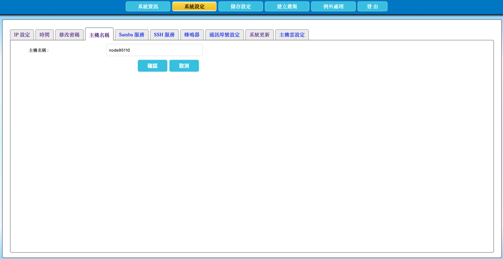

# 2.9 修改主機名稱

本節說明如何修改 AcroCube 超融合主機的主機名稱（Hostname）。主機名稱會用於辨識這台 AcroCube 主機，並會顯示在後續的 AcroVMS 管理系統中；建議依組織的命名規範設定清楚且唯一的名稱。

> **重要：** 儲存主機名稱設定後，AcroCube 超融合主機會自動重新開機。重新開機期間管理介面與主機服務可能暫時無法使用，請在維護時段進行，並先確認對既有工作負載與管理作業的影響。

## 主機名稱設定畫面說明

在頂端功能列點選「**系統設定**」，再選擇「**主機名稱**」頁籤，即可開啟主機名稱設定畫面。

| 項目 | 說明 |
| --- | --- |
| 主機名稱 | 顯示目前主機名稱，並可輸入新的名稱。這個名稱將用來在 AcroVMS 與維運作業中辨識主機。 |
| 確認 | 儲存新的主機名稱設定，並觸發主機重新開機。 |
| 取消 | 放棄尚未儲存的變更，保留目前主機名稱。 |

範例畫面中的 `node95110` 為目前主機名稱，僅供說明使用。實際名稱請依環境、機房、用途、叢集或節點編號等組織規範設定。



## 前置條件

- 已以具管理權限的帳號登入 AcroCube Client。
- 已確認新的主機名稱符合組織的命名規範，且不會與同一管理環境中的其他主機混淆。
- 已安排維護時段，並通知可能受重新開機影響的使用者或維運人員。
- 若主機已加入管理系統或叢集，已確認名稱變更的維運程序與影響範圍。

## 主機名稱規劃建議

建議名稱能清楚表示主機角色與位置，例如：

```text
acrocube-tpe-01
```

此範例可表示位於臺北環境的第一台 AcroCube 主機。實際格式應以組織既有的 DNS、資產管理、監控與維運命名規範為準。

為降低相容性與辨識問題，建議使用英文字母、數字與連字號（`-`），避免空白、特殊字元或容易與其他主機混淆的名稱。系統實際允許的字元與長度仍以畫面驗證結果及產品版本為準。

## 修改主機名稱步驟

1. 在「主機名稱」欄位輸入新的主機名稱。
2. 再次確認名稱拼寫、主機編號與命名規則均正確。
3. 按下「**確認**」儲存設定。
4. 系統會自動重新開機。請等待主機完成開機，不要在重新開機期間關閉電源、拔除網路線或變更儲存設定。
5. 開機完成後，重新登入 AcroCube Client，確認主機名稱已更新，並在 AcroVMS 管理系統中確認顯示名稱是否正確。

若不想套用本次變更，請按「取消」。

## 注意事項

- 儲存主機名稱後會觸發主機重新開機，可能中斷管理連線與相關服務。
- 主機名稱變更不代表管理 IP 位址會一併變更；請仍使用目前有效的管理 IP 重新登入，除非另行修改網路設定。
- 若主機名稱與 DNS、監控、資產管理或其他外部系統有關聯，變更前應先確認相對應的維運程序。
- 主機重新開機完成後，請確認 AcroVMS 中顯示的名稱與實際主機相符。
