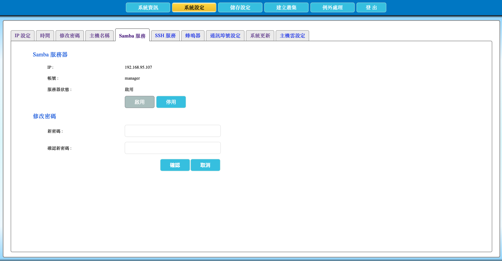

# 2.10 設定 SAMBA 服務

本節說明如何啟用或停用 AcroCube 的 SAMBA（SMB）服務，以及修改該服務帳號的密碼。此服務主要協助 AcroFlex 超融合系統管理 ISO 檔案、匯入或匯出雲主機（虛擬機器），以及提供實體轉虛擬（P2V）或虛擬轉虛擬（V2V）映像檔所需的檔案存取。

> **重要：** 若停用 SAMBA 服務，AcroFlex 超融合系統中依賴此檔案服務的作業可能無法執行。除非已確認維護影響與替代流程，否則請保持服務啟用。

## SAMBA 服務設定畫面說明

在頂端功能列點選「**系統設定**」，再選擇「**Samba 服務**」頁籤，即可開啟設定畫面。畫面分為「Samba 服務器」與「修改密碼」兩個區域。

| 項目 | 說明 |
| --- | --- |
| IP | 顯示 SAMBA 服務使用的 AcroCube 主機 IP 位址。用戶端是否能存取仍取決於網路路由、防火牆與 SMB 用戶端設定。 |
| 帳號 | SAMBA 服務的固定帳號名稱為 `manager`。本服務不支援新增其他 SAMBA 帳號。 |
| 服務器狀態 | 顯示服務目前是否啟用。範例中顯示「啟用」，表示服務正在運行。 |
| 啟用／停用 | 用於啟動或停止 SAMBA 服務。實際可操作按鈕會依目前服務狀態而異。 |
| 新密碼 | 輸入要設定給 `manager` 帳號的新密碼。 |
| 確認新密碼 | 再次輸入相同的新密碼，以避免輸入錯誤。 |
| 確認／取消 | 確認會儲存本次設定；取消則放棄尚未儲存的密碼變更。 |

範例畫面中的 IP 位址僅供說明使用。SAMBA 服務帳號固定為 `manager`，出廠預設密碼為 `acrored`；首次使用後請立即變更預設密碼。

## 前置條件

- 已以具管理權限的帳號登入 AcroCube Client。
- 已完成 AcroCube 網路設定，且需使用 SAMBA 的管理端、工作站或服務可連線至 AcroCube。
- 已確認組織的網路安全設備允許必要的 SMB 檔案服務通訊，並依資安規範限制存取來源。
- 已準備符合組織密碼政策的新密碼，並有安全的保存或交付方式。

## 1. 啟用 SAMBA 服務

在「Samba 服務器」區域檢查「服務器狀態」。若服務尚未啟用，按下「**啟用**」啟動服務；啟用後，請再次確認狀態已更新為可用狀態。

若服務已啟用，如範例所示，無須重複啟用。請不要因非必要的測試而按下「停用」，以免影響 ISO 管理、雲主機匯入／匯出或映像檔轉換等相關作業。

## 2. 修改 `manager` 帳號密碼

1. 在「新密碼」欄位輸入 `manager` 帳號的新密碼。
2. 在「確認新密碼」欄位再次輸入完全相同的新密碼。
3. 確認兩次輸入一致後，按下「**確認**」儲存新密碼。
4. 以新的密碼測試經授權的 SAMBA 存取流程，並將密碼更新至組織核准的密碼管理機制。

若不想套用本次密碼變更，請按「取消」。若無法儲存，請確認兩次新密碼完全相同，並依系統畫面提示檢查密碼規範。

## 3. 驗證服務可用性

完成啟用與密碼設定後，確認服務器狀態仍為啟用。接著依組織的標準作業程序，以授權的用戶端使用 `manager` 帳號測試 SAMBA 檔案存取。

如無法存取，請依序檢查 AcroCube IP 位址、用戶端與主機的網路連通性、防火牆或 SMB 存取規則、帳號密碼，以及服務是否仍處於啟用狀態。

## 注意事項

- 本 SAMBA 服務僅提供單一固定帳號 `manager`，無法新增其他帳號。
- `manager` 的出廠預設密碼為 `acrored`，首次使用後應立即修改，且不要以預設密碼長期運作。
- 停用 SAMBA 服務可能使 AcroFlex 的 ISO 管理、雲主機匯入／匯出及 P2V／V2V 映像檔作業無法進行。
- 請將 SMB 存取範圍限制於受信任的管理網路，並依組織資安政策管理帳號與密碼。
