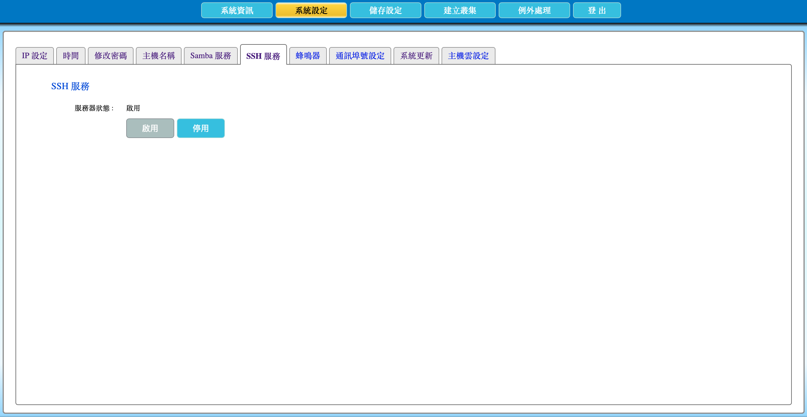

# 2.11 啟用或停用 SSH 服務

本節說明如何啟用或停用 AcroCube 的 SSH 服務。SSH 主要提供 AcroRed 原廠或經授權技術人員進行深度系統維護使用；一般使用者不建議啟用或使用此服務。

> **重要：** SSH 服務預設為停用。AcroCube 主機重新開機後，SSH 服務會自動恢復為停用狀態；若原廠支援需要遠端維護，應在指定維護時段暫時啟用，並在作業完成後停用。

## SSH 服務設定畫面說明

在頂端功能列點選「**系統設定**」，再選擇「**SSH 服務**」頁籤，即可開啟 SSH 服務設定畫面。

| 項目 | 說明 |
| --- | --- |
| 服務器狀態 | 顯示 SSH 服務目前是否啟用。範例畫面顯示「啟用」，表示此時 SSH 服務正在運行。 |
| 啟用 | 啟動 SSH 服務，允許經授權的維護人員依既定程序進行 SSH 連線。 |
| 停用 | 停止 SSH 服務，關閉透過 SSH 的遠端維護存取。 |

畫面中按鈕的可操作狀態會依目前服務狀態而異。例如服務已啟用時，「啟用」按鈕可能不可操作，而可使用「停用」結束服務。

## 前置條件

- 已以具管理權限的帳號登入 AcroCube Client。
- 已完成 AcroCube 網路設定，且經授權的維護端可連線至 AcroCube 管理網路。
- 已取得 AcroRed 原廠技術支援或組織授權人員的維護指示。
- 已確認維護時段、可存取來源與資安規範；不要在不受信任的網路中啟用 SSH。

## 1. 啟用 SSH 服務

僅在原廠支援或經授權的系統維護需要時，於「SSH 服務」頁面按下「**啟用**」。啟用後，確認「服務器狀態」顯示為啟用，再由獲授權的維護人員依既定程序進行連線。

啟用服務前，請確認連線來源已受網路或防火牆規則限制，並避免將 SSH 對不受信任的網路開放。

## 2. 停用 SSH 服務

原廠支援或維護作業完成後，按下「**停用**」停止 SSH 服務，並確認服務器狀態已更新為停用。這可降低不必要的遠端管理介面暴露風險。

即使未手動停用，AcroCube 主機重新開機後 SSH 服務也會回復為預設停用狀態；但不應以重新開機作為一般的服務停用方式，維護完成後應直接確認服務狀態。

## 注意事項

- SSH 服務主要供原廠深度系統維護使用；一般使用者不建議自行使用或長時間啟用。
- SSH 服務預設停用，且主機重新開機後會自動恢復為停用狀態。
- 若啟用後無法連線，請先確認服務狀態、主機網路連通性、管理網路路由及組織的防火牆規則。
- 不要將 SSH 連線資訊或維護憑證提供給未授權的人員。
- 維護完成後應立即停用 SSH，並記錄維護期間、授權人員與執行內容。
