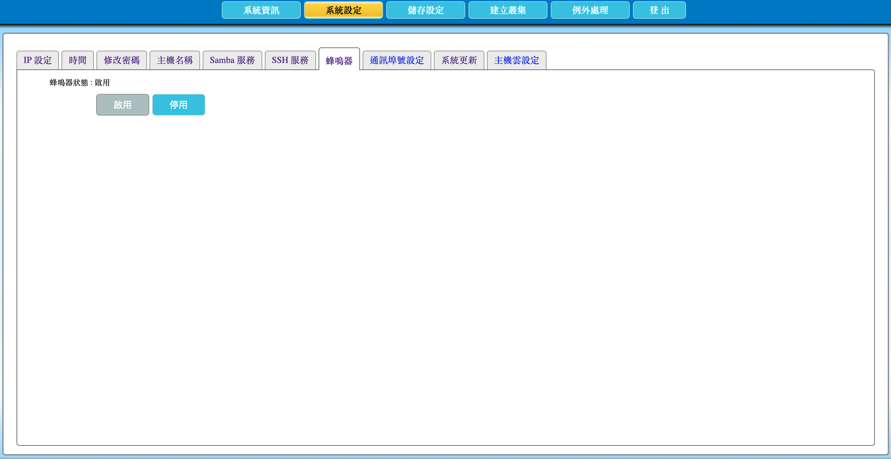

# 2.12 啟用或停用蜂鳴器

本節說明如何啟用或停用 AcroCube 超融合主機的蜂鳴器。蜂鳴器可在系統開機、系統發生問題，以及對 AcroCube 主機執行定位作業時發出聲音，協助現場人員辨識主機狀態與位置。

AcroCube 開機時，聽到 **3 聲** 代表作業系統開機完成；聽到 **9 聲** 代表全系統服務已準備完成。這些聲音可作為開機流程的現場輔助資訊，仍應以管理介面顯示的系統狀態與事件記錄作為最終判斷依據。

> **注意：** 停用蜂鳴器後，主機發生異常或被定位時不會提供聲音提示。若機房依賴聲音告警協助現場維護，建議保持蜂鳴器啟用。

## 蜂鳴器設定畫面說明

在頂端功能列點選「**系統設定**」，再選擇「**蜂鳴器**」頁籤，即可開啟蜂鳴器設定畫面。

| 項目 | 說明 |
| --- | --- |
| 蜂鳴器狀態 | 顯示目前蜂鳴器是否啟用。範例畫面顯示「啟用」，代表主機可在適用事件發出聲音。 |
| 啟用 | 開啟蜂鳴器功能，使主機可在開機、異常或定位等情境提供聲音提示。 |
| 停用 | 關閉蜂鳴器功能，使主機不再提供上述情境的聲音提示。 |

畫面中按鈕的可操作狀態會依目前設定而異。例如蜂鳴器已啟用時，「啟用」按鈕可能不可操作，而可使用「停用」關閉功能。

## 前置條件

- 已以具管理權限的帳號登入 AcroCube Client。
- 已確認主機所在位置與機房維護規範，並評估聲音告警對現場人員的影響。
- 若要停用蜂鳴器，已確認可透過管理介面、監控系統或其他告警機制掌握主機異常。

## 1. 啟用蜂鳴器

在「蜂鳴器」頁面按下「**啟用**」，使蜂鳴器可在適用事件發出聲音。啟用後，確認「蜂鳴器狀態」顯示為啟用。

建議在新主機安裝、機房維護或需要使用定位功能時保持啟用，以便現場人員快速辨識指定主機。

## 2. 停用蜂鳴器

若機房環境不適合發出聲音，或已具備完善的替代監控與告警機制，可按下「**停用**」關閉蜂鳴器。完成後，確認「蜂鳴器狀態」已更新為停用。

停用前，請評估是否會影響故障處理與實體主機定位效率。若不確定，建議維持啟用。

## 注意事項

- 開機聽到 3 聲表示作業系統開機完成；9 聲表示全系統服務已準備完成。
- 蜂鳴器也會在系統問題或主機定位等情境提供聲音提示。
- 聲音提示僅作為輔助資訊，系統健康狀態與故障原因仍應以 AcroCube／AcroVMS 管理介面、系統記錄與告警訊息為準。
- 停用蜂鳴器會降低現場聲音告警與定位辨識能力，請確認替代的監控機制可用。
