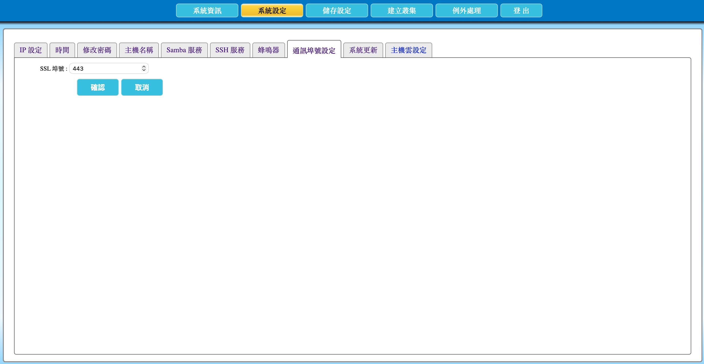

# 2.13 設定 AcroCube 管理介面的埠號

本節說明如何修改 AcroCube 超融合主機網頁管理介面的 HTTPS／SSL 通訊埠。管理介面預設使用 HTTPS 埠號 `443`；若組織的網路政策或防火牆規劃要求，可改用其他埠號。

> **重要：** 變更埠號可能使目前的管理介面連線中斷。請先在防火牆、網路存取控制或反向代理設定中允許新的 HTTPS 埠，再變更 AcroCube 設定，並記錄新的登入網址。

## 管理介面埠號設定畫面說明

在頂端功能列點選「**系統設定**」，再選擇「**通訊埠號設定**」頁籤，即可開啟管理介面埠號設定畫面。

| 項目 | 說明 |
| --- | --- |
| SSL 埠號 | 設定 AcroCube 網頁管理介面的 HTTPS 通訊埠。預設值為 `443`。 |
| 確認 | 儲存輸入的埠號設定。儲存後，後續管理連線應使用新的埠號。 |
| 取消 | 放棄尚未儲存的變更，保留目前埠號。 |

範例畫面顯示 SSL 埠號為 `443`，表示可使用預設的 HTTPS 網址連線，例如 `https://<AcroCube 管理 IP>/`。



## 前置條件

- 已以具管理權限的帳號登入 AcroCube Client。
- 已確認新埠號符合組織的網路與資安規範，且未被同一主機上的其他服務使用。
- 已在防火牆、網路存取控制、負載平衡器或反向代理等相關設備先開放新的 HTTPS 埠號。
- 已通知管理者新的連線方式，並已記錄目前設定，以便在變更失敗時進行排查。

## 埠號規劃建議

可設定的埠號範圍為 `1` 至 `65535`。不過，`1` 至 `1024` 為常見的系統與知名服務埠範圍，其中可能已有其他服務使用；除預設 HTTPS 埠 `443` 外，建議避免任意使用這個範圍，以降低衝突風險。

選擇新埠號前，請確認：

- 埠號未與主機既有服務或組織網路服務衝突。
- 防火牆規則只允許受信任的管理來源存取該埠。
- 監控、書籤、自動化工具及維運文件已準備更新為新網址。

> **提醒：** 使用非預設埠可配合網路管理政策，但不能取代帳號密碼、網路隔離、防火牆與存取控制等安全措施。

## 修改埠號步驟

1. 確認相關防火牆與網路設備已允許新的 HTTPS 埠號。
2. 在「SSL 埠號」欄位輸入新埠號。數值必須介於 `1` 至 `65535`。
3. 再次確認埠號沒有與既有服務衝突。
4. 按下「**確認**」儲存設定。
5. 使用新的網址重新連線至管理介面。例如新埠號為 `8443` 時，連線格式為：

   ```text
   https://<AcroCube 管理 IP>:8443/
   ```

6. 確認可正常登入後，更新管理端書籤、監控設定、自動化工具及維運文件。

若不想套用本次變更，請按「取消」。

## 注意事項

- 管理介面預設使用 HTTPS 埠 `443`；變更後必須在網址中明確指定新的埠號。
- 變更前應先開放防火牆規則，否則可能無法以新埠號重新連線。
- 不要使用已被其他服務占用的埠號，尤其應謹慎使用 `1` 至 `1024` 的常見系統與知名服務埠。
- 變更埠號後，請確認所有管理與維運相關設定均已更新，以避免後續無法連線或監控失敗。
