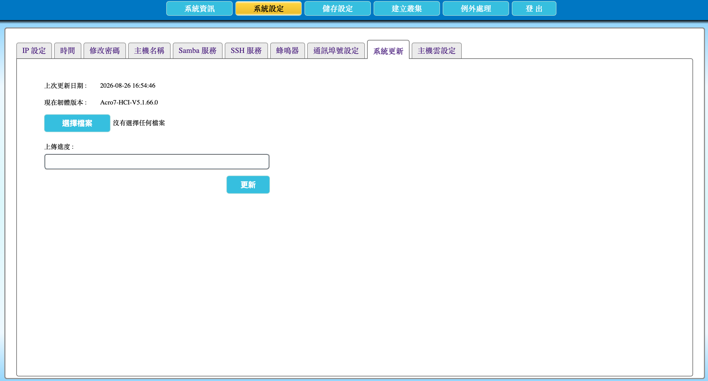
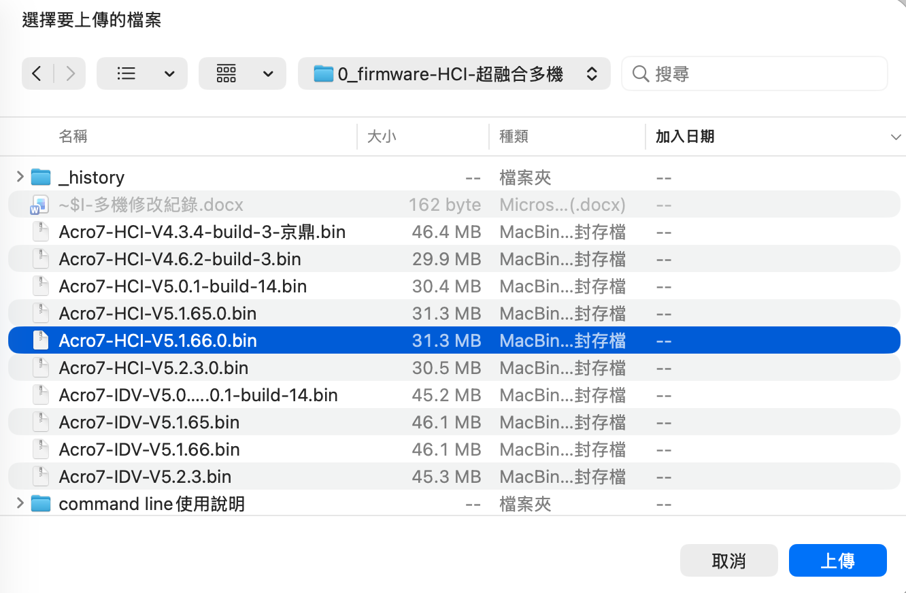
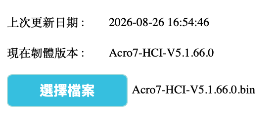

# 2.14 更新 AcroCube 韌體

本節說明如何透過 AcroCube Client 上傳並更新 AcroCube 超融合主機韌體。韌體更新完成後，系統會自動重新開機；請在維護時段執行，並預先通知相關使用者。

> **重要：** 更新前務必核對目前韌體版本與準備上傳的韌體檔案版本，確認所選檔案為預計套用的較新版本。請僅使用由 AcroRed 提供或確認適用於該主機的韌體檔案。

## 系統更新頁面說明

在頂端功能列點選「**系統設定**」，再選擇「**系統更新**」頁籤，即可開啟韌體更新頁面。

| 項目 | 說明 |
| --- | --- |
| 上次更新日期 | 顯示上一次完成韌體更新的日期與時間，供管理者追蹤更新紀錄。 |
| 現在韌體版本 | 顯示目前 AcroCube 主機正在使用的韌體版本。更新前應記錄此版本，以便和新韌體版本比較。 |
| 選擇檔案 | 開啟作業系統的檔案選擇視窗，用來選取要上傳的 AcroCube 韌體檔案。 |
| 已選檔案名稱 | 在選取檔案後顯示檔名；未選取時顯示「沒有選擇任何檔案」。 |
| 上傳進度 | 顯示韌體檔案上傳至主機的進度。上傳未完成前，不應關閉頁面或中斷管理連線。 |
| 更新 | 在檔案上傳及版本確認完成後，開始執行韌體更新。 |

下圖範例中，目前韌體版本為 `Acro7-HCI-V5.1.66.0`，尚未選取更新檔案，因此「選擇檔案」旁顯示「沒有選擇任何檔案」。

## 前置條件

- 已以具管理權限的帳號登入 AcroCube Client。
- 已取得適用於該 AcroCube 主機的韌體檔案，並儲存在管理電腦可存取的位置。
- 已安排維護時段，並確認韌體更新與系統自動重新開機可能影響管理服務及工作負載。
- 已記錄目前韌體版本、確認新檔案版本及更新內容，並依組織規範完成必要的備份與變更程序。
- 更新期間請保持管理電腦與 AcroCube 的網路連線穩定，且不要關閉瀏覽器或中斷電源。

## 更新韌體步驟

### 1. 選擇韌體檔案

在「系統更新」頁面按下「**選擇檔案**」。AcroCube Client 會開啟作業系統的檔案選擇視窗。

瀏覽管理電腦的檔案系統，選取要更新的 AcroCube 韌體檔案，再按「**上傳**」。下圖以 `Acro7-HCI-V5.1.66.0.bin` 為例，說明在檔案選擇視窗中選取韌體檔案後上傳的操作。

### 2. 確認目前與新韌體版本

檔案選取後，頁面會顯示已選擇的韌體檔名。請比較頁面中的「現在韌體版本」與檔名所代表的新韌體版本，確認檔案確實是預計更新的版本，且新版本號高於目前版本。

下圖範例顯示目前版本為 `Acro7-HCI-V5.1.66.0`，已選取檔案為 `Acro7-HCI-V5.1.66.0.bin`。實際操作時，應依組織的更新計畫，確認選取檔案的版本與目前版本及預期更新版本一致；若版本不符或無法確認，請不要繼續更新。

### 3. 上傳與更新韌體

1. 確認已選取正確的韌體檔案。
2. 等待上傳進度完成；上傳期間請勿重新整理頁面、關閉瀏覽器或中斷網路連線。
3. 再次核對目前版本與新韌體檔案版本。
4. 按下「**更新**」開始韌體更新。
5. 等待更新作業完成。完成後，系統會自動重新開機。

## 更新後確認

系統重新開機並恢復可連線後，重新登入 AcroCube Client，回到「系統更新」頁面檢查「現在韌體版本」及「上次更新日期」。確認顯示的版本為預期的新版本，並依維護程序確認主機與相關服務運作正常。

## 注意事項

- 韌體更新會觸發系統自動重新開機，請避免在未安排的服務時段執行。
- 更新前應確實比較目前韌體版本與新韌體檔案的版本編號，避免重複更新、誤用舊檔或上傳不適用的韌體。
- 選擇檔案與上傳期間，請維持穩定的網路及電源；不要任意離開頁面或中斷作業。
- 若版本、檔案來源或相容性有疑慮，請先向 AcroRed 技術支援確認，再進行更新。
- 更新完成後，務必再次檢查韌體版本，並記錄更新時間、檔案版本及確認結果。
