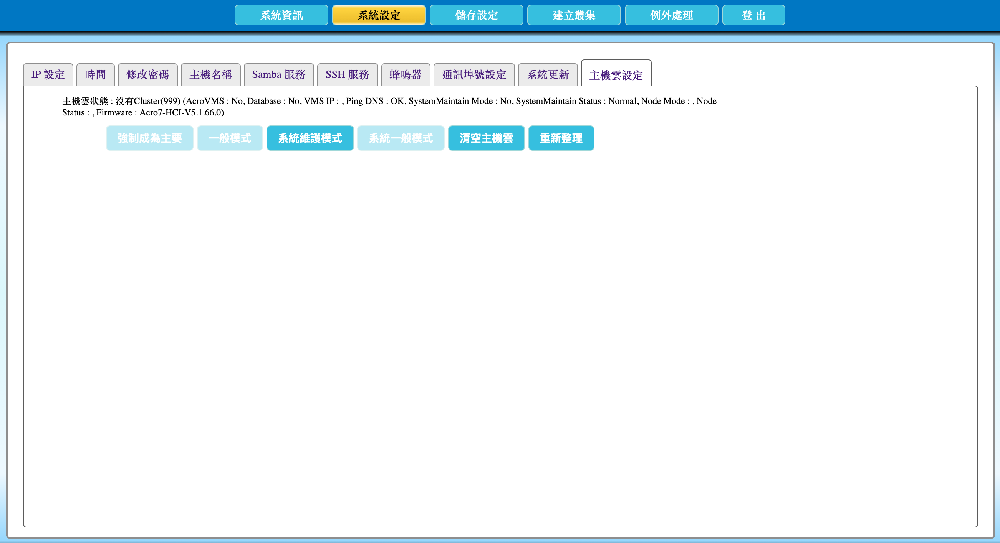

# 2.16 將 AcroCube 主機強制設定成一般模式

本節說明如何將處於維護模式的 AcroCube 超融合主機強制切換為一般模式。維護模式通常用於主機維護作業，例如韌體更新；處於維護模式的主機無法提供一般服務。主機切換回一般模式後，才能恢復提供服務，例如執行虛擬機器。

> **重要：** 請僅在確認主機維護作業已完成、主機硬體與系統狀態正常後，才將主機切換回一般模式。若韌體更新、硬體更換或故障排除尚未完成，過早切換可能使未完成維護的主機重新加入服務。

## 主機雲設定頁面說明

在頂端功能列點選「**系統設定**」，再選擇「**主機雲設定**」頁籤，即可開啟主機雲狀態與模式設定功能。

頁面上方的「主機雲狀態」會顯示目前主機所在叢集、AcroVMS／資料庫狀態、VMS IP、DNS 連通性、系統維護模式、節點模式、節點狀態及韌體版本等資訊。切換前後都應檢查並記錄這些狀態，以確認主機模式與系統狀態符合預期。

| 項目 | 說明 |
| --- | --- |
| 主機雲狀態 | 顯示目前 AcroCube 主機與主機雲的狀態資訊，例如叢集、AcroVMS、資料庫、VMS IP、DNS、維護模式、節點狀態及韌體版本。 |
| 強制成為主要 | 將目前主機強制設定為主要主機；本節不說明此功能。 |
| 一般模式 | 將目前這台處於維護模式的 AcroCube 主機強制切換為一般模式。 |
| 系統維護模式 | 用於將系統設定為系統維護模式；本節不說明此功能。 |
| 系統一般模式 | 用於將系統回到一般模式；本節不說明此功能。 |
| 清空主機雲 | 用於清除主機雲相關設定；本節不說明此功能。 |
| 重新整理 | 重新讀取並顯示目前的主機雲狀態。 |

下圖為「主機雲設定」頁面範例。可先查看「主機雲狀態」中的維護模式、節點模式及節點狀態等資訊，再決定是否可以按下「一般模式」。

## 前置條件

- 已以具管理權限的帳號登入 AcroCube Client。
- 已確認目前 AcroCube 主機處於維護模式，且該維護作業已完成。
- 已確認韌體更新、硬體更換、故障處理或其他維護工作均已完成，且不需要繼續隔離主機。
- 已確認主機網路、儲存裝置與系統健康狀態沒有待處理的異常。
- 已通知相關管理者，並了解主機切換回一般模式後可能重新參與服務提供。

## 切換為一般模式

1. 進入「系統設定」的「主機雲設定」頁面。
2. 檢查「主機雲狀態」，確認目前主機確實處於維護模式，並再次確認所有維護工作已完成。
3. 按下「**一般模式**」。
4. 等待系統完成模式切換。
5. 按下「**重新整理**」更新狀態資訊，確認維護模式、節點模式及節點狀態已依預期更新。
6. 依維護程序確認主機可正常提供服務，例如確認虛擬機器或其他應由該主機承載的服務狀態。

## 注意事項

- 維護模式中的主機不提供一般服務；僅在主機確認可安全回復服務後，才切換為一般模式。
- 若主機仍有硬體、網路、儲存或韌體異常，應保持維護模式並完成排除後再切換。
- 執行「一般模式」後，請使用「重新整理」確認狀態，並以實際服務運作情況完成驗證。
- 若無法確認主機是否適合離開維護模式，請先停止操作並依組織維護程序或向 AcroRed 技術支援確認。
