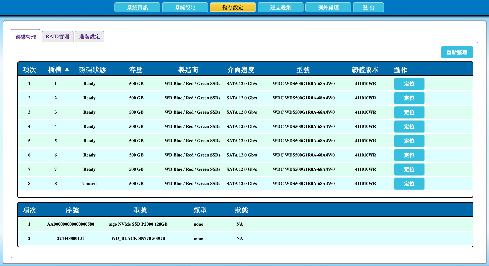

# 2.19 定位磁碟機

本節說明如何在 AcroCube 主機的「磁碟管理」頁面定位指定磁碟機的實體插槽。按下磁碟列中的「定位」後，該磁碟所在插槽的指示燈會亮起 **20 秒**，協助現場人員辨識正確的磁碟位置。

> **重要：** 定位功能僅用於辨識實體插槽位置，不會修復磁碟故障。執行更換、拔除或插入磁碟前，必須先依磁碟狀態、插槽號、型號與序號再次核對，避免誤操作仍在使用中的磁碟。

## 磁碟管理頁面說明

在頂端功能列點選「**儲存設定**」，再選擇「**磁碟管理**」頁籤，即可檢視磁碟列表與定位功能。

上方磁碟列表顯示安裝於主機插槽中的磁碟；每一列最右側的「動作」欄皆提供「定位」按鈕。下方列表則顯示其他由系統偵測到的儲存裝置資訊。需要定位實體插槽時，應以具有「插槽」欄與「定位」按鈕的上方磁碟列表為準。

| 欄位 | 說明 |
| --- | --- |
| 項次 | 磁碟列表中的項目順序。 |
| 插槽 | 磁碟安裝於 AcroCube 主機的實體插槽編號，是現場辨識磁碟位置的主要依據。 |
| 磁碟狀態 | 顯示磁碟目前狀態。範例畫面可見 `Ready` 與 `Unused` 等狀態；處理異常磁碟時應依實際顯示狀態判斷。 |
| 容量 | 顯示磁碟容量，協助與實體磁碟標示比對。 |
| 製造商 | 顯示磁碟製造商資訊。 |
| 介面速度 | 顯示磁碟介面與連線速度資訊。 |
| 型號 | 顯示磁碟型號，可用於確認操作目標。 |
| 韌體版本 | 顯示磁碟韌體版本，供維護與相容性確認。 |
| 動作／定位 | 按下「定位」後，對應插槽的指示燈亮起 20 秒。 |
| 重新整理 | 重新讀取並更新頁面上的磁碟資訊。 |

下圖範例顯示上方磁碟列表中的各磁碟列皆有「定位」按鈕；例如要定位插槽 3 的磁碟，應先確認該列的插槽、狀態、容量與型號，再按該列最右側的「定位」。

## 前置條件

- 已以具管理權限的帳號登入 AcroCube Client。
- 已在「磁碟管理」頁面找出需要確認的磁碟列。
- 已準備前往主機現場查看實體插槽的指示燈，或已與現場人員建立聯繫。
- 若磁碟疑似故障，已先記錄其插槽、狀態、容量、型號及韌體版本等資訊。

## 定位磁碟機步驟

1. 進入「儲存設定」的「磁碟管理」頁面。
2. 在上方磁碟列表中，依插槽、磁碟狀態、容量、製造商與型號找出要定位的磁碟。
3. 再次核對該列的「插槽」編號與磁碟資訊，確認目標正確。
4. 按下該磁碟列「動作」欄中的「**定位**」。
5. 前往 AcroCube 主機前方或對應的磁碟插槽，確認該插槽指示燈亮起；指示燈會持續約 20 秒。
6. 若需要更換或處理磁碟，請在操作前再次比對實體插槽號與管理介面中的磁碟資料。

## 注意事項

- 指示燈只亮 20 秒；若現場人員未及辨識，可在重新核對目標後再次按下「定位」。
- 不要僅依磁碟狀態或外觀判斷要處理的磁碟，應同時核對插槽、容量、型號與其他可辨識資訊。
- 若磁碟屬於 RAID、快取或正在使用的儲存資源，未依正確維護程序拔除可能造成資料或服務風險。
- 定位完成後，若要更換故障磁碟，請依組織維護流程及相關磁碟／RAID 管理章節執行。
