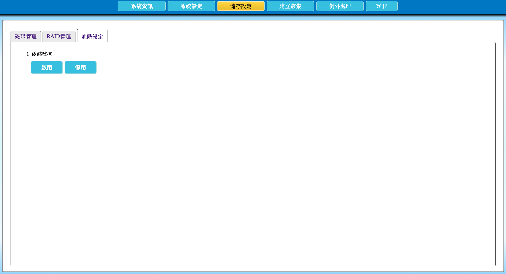

# 2.20 啟用或停用磁碟監控

本節說明如何啟用或停用 AcroCube 的磁碟監控功能。磁碟監控可在針對磁碟速度變慢、偶發卡頓或其他儲存異常進行偵錯時，提供較多的診斷資訊；但啟用後會消耗部分 CPU 與磁碟效能。

> **注意：** 磁碟監控適合在故障分析或 AcroRed 技術支援建議的期間暫時啟用。若系統承載重要工作負載，啟用前應評估額外資源消耗與效能影響；完成問題分析後，建議停用以恢復一般資源使用狀態。

## 進階設定頁面說明

在頂端功能列點選「**儲存設定**」，再選擇「**進階設定**」頁籤，即可開啟磁碟監控設定。

| 項目 | 說明 |
| --- | --- |
| 磁碟監控 | 磁碟監控功能的設定區塊。啟用後，系統會收集更多與磁碟運作相關的資訊，協助問題分析。 |
| 啟用 | 開始磁碟監控。啟用後會增加 CPU 與磁碟資源使用量。 |
| 停用 | 停止磁碟監控，降低額外的資源消耗。 |

畫面中的按鈕可用狀態可能會隨目前設定而改變。例如監控已啟用時，「啟用」按鈕可能不可操作，而可使用「停用」結束監控。

## 前置條件

- 已以具管理權限的帳號登入 AcroCube Client。
- 已發現需要進一步分析的儲存問題，例如磁碟速度變慢、偶發卡頓或不明原因的磁碟存取異常。
- 已評估啟用監控對 CPU 與磁碟效能的影響，並在需要時安排維護或觀察時段。
- 已記錄問題發生的時間、影響範圍及相關症狀，方便後續比對監控期間的資訊。

## 啟用磁碟監控

1. 進入「儲存設定」的「進階設定」頁面。
2. 確認目前需要收集磁碟診斷資訊，並了解啟用監控可能增加系統資源使用量。
3. 按下「**啟用**」。
4. 確認畫面狀態已更新；若按鈕可用狀態改變，代表系統已套用新的監控設定。
5. 在問題重現或觀察期間，記錄發生時間與現象，並依組織程序蒐集相關系統資訊供分析。

## 停用磁碟監控

1. 問題分析完成，或不再需要額外的磁碟診斷資訊時，回到「進階設定」頁面。
2. 按下「**停用**」。
3. 確認畫面狀態已更新，表示監控已停止。
4. 記錄監控啟用與停用時間，以及分析結果或後續處理事項。

## 注意事項

- 磁碟監控會消耗部分 CPU 與磁碟效能；不應在沒有診斷需求時長時間啟用。
- 啟用前後應觀察工作負載效能與磁碟狀態，以便區分原有問題與監控造成的額外負載。
- 停用監控不會修復磁碟故障；若已發現硬體或 RAID 異常，仍應依磁碟／RAID 維護程序處理。
- 若問題持續或無法判讀監控資訊，請保留相關記錄並向 AcroRed 技術支援尋求協助。
