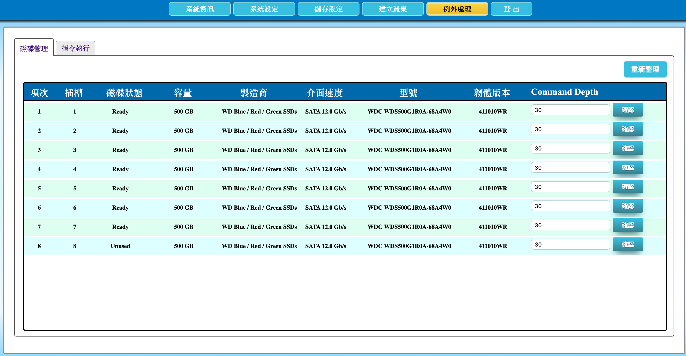

# 2.21 設定磁碟機之最大佇列數量

本節說明如何設定各磁碟機的最大 I/O 佇列數量（Command Depth）。此參數會影響磁碟同時處理的 I/O 要求數量，對 I/O 效能與磁碟負載有重大影響。

> **重要：** 非 AcroRed 原廠人員不建議調整此設定。最大 I/O 佇列值不是越大越好，必須配合磁碟規格、介面、目前狀態與實際工作負載評估。錯誤的值可能使 I/O 更慢，或增加磁碟負載並加速老化。請先聯絡 AcroRed 原廠人員取得建議值。

## 磁碟機佇列設定頁面說明

在頂端功能列點選「**例外處理**」，再選擇「**磁碟管理**」頁籤，即可開啟各磁碟機的 Command Depth 設定頁面。

頁面以磁碟列表呈現每顆磁碟的基本資訊，最右側的「Command Depth」欄提供輸入欄位與「確認」按鈕。每一列的設定獨立套用，調整時必須確認操作的是正確插槽與正確磁碟。

| 欄位 | 說明 |
| --- | --- |
| 項次 | 磁碟列表中的項目順序。 |
| 插槽 | 磁碟安裝於 AcroCube 主機的實體插槽編號，是辨識設定目標的主要依據。 |
| 磁碟狀態 | 顯示磁碟目前狀態，例如範例畫面中的 `Ready`、`Unused`。應先確認狀態，再決定是否適合調整。 |
| 容量 | 顯示磁碟容量，協助確認目標磁碟。 |
| 製造商 | 顯示磁碟製造商資訊。 |
| 介面速度 | 顯示磁碟介面與連線速度資訊。 |
| 型號 | 顯示磁碟型號，是原廠評估建議值的重要參考資訊。 |
| 韌體版本 | 顯示磁碟韌體版本，供相容性與問題分析使用。 |
| Command Depth | 輸入該磁碟的最大 I/O 佇列數量。範例畫面顯示值為 `30`，僅代表畫面範例，不應視為所有磁碟的通用建議值。 |
| 確認 | 儲存該列輸入的 Command Depth 值。 |
| 重新整理 | 重新讀取並更新頁面上的磁碟與設定資訊。 |

下圖範例中，每顆磁碟的 Command Depth 欄位均顯示 `30`，且每列都有獨立的「確認」按鈕。調整前應以插槽、型號、狀態及原廠建議值核對目標，不要直接複製其他磁碟的數值。

## 前置條件

- 已以具管理權限的帳號登入 AcroCube Client。
- 已聯絡 AcroRed 原廠人員，並取得目標磁碟與工作負載適用的 Command Depth 建議值。
- 已確認目標磁碟的插槽、製造商、型號、介面速度、韌體版本及目前狀態。
- 已記錄目前 Command Depth 值，以便調整後比較，並在需要時依原廠指示還原。
- 已評估調整可能影響主機 I/O 效能與服務，必要時安排維護或觀察時段。

## 設定最大 I/O 佇列數量

1. 進入「例外處理」的「磁碟管理」頁面。
2. 在磁碟列表中確認目標磁碟的插槽、型號、介面速度與磁碟狀態。
3. 將上述磁碟規格、目前狀態、現行 Command Depth 與工作負載資訊提供給 AcroRed 原廠人員，確認建議設定值。
4. 在目標磁碟列的「Command Depth」輸入欄位中，輸入原廠建議的值。
5. 再次確認輸入值與磁碟列正確，避免修改到其他插槽的磁碟。
6. 按下該列的「**確認**」儲存設定。
7. 依原廠建議與維護程序觀察磁碟 I/O 效能、延遲與服務狀態，並記錄調整結果。

## 注意事項

- 最大 I/O 佇列值不是越大越好；設定值必須契合磁碟規格、介面、健康狀態與工作負載。
- 錯誤設定可能降低 I/O 效能，並因不適當負載增加磁碟老化風險。
- 不應在未取得原廠建議時任意調整，也不應把同一數值直接套用到不同型號或不同狀態的磁碟。
- 調整後若效能惡化、延遲升高或出現異常，請記錄變更時間與數值，並立即依原廠指示處理或還原。
- 這項設定屬於進階例外處理功能；一般效能問題應先完成磁碟、RAID、快取與系統狀態的基本檢查。
