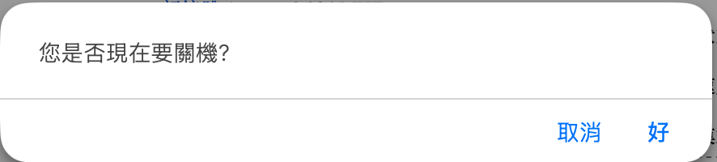

# 2.23 關閉 AcroCube 主機

本節說明如何透過 AcroCube Client 正常關閉 AcroCube 超融合主機。請使用管理頁面的關機功能執行正常關機流程，避免直接中斷主機電源。

> **重要：** 關機會中斷該 AcroCube 主機提供的服務，可能影響虛擬機器、儲存與 AcroFlex 主機雲的管理作業。僅應在已安排的維護時段、完成工作負載處理並取得必要授權後執行。

## 關機功能位置

關機功能位於 AcroCube Client 右上角的電源圖示選單。點選電源圖示後，選單會顯示「**關機**」與「**重開機**」兩個項目。本節僅說明「關機」功能。

## 前置條件

- 已以具管理權限的帳號登入 AcroCube Client。
- 已安排維護時段，並通知可能受影響的使用者與管理者。
- 已依組織維護程序處理或確認該主機承載的虛擬機器、工作負載、儲存作業與管理服務。
- 已確認沒有正在進行的韌體更新、磁碟／RAID 作業、備份、還原或其他不可中斷的工作。
- 已評估關閉此主機對 AcroFlex 主機雲與其他節點的影響，並完成必要的服務移轉或保護措施。

## 關閉主機步驟

1. 確認所有前置條件已完成，且目前沒有未儲存的管理設定變更。
2. 點選 AcroCube Client 右上角的電源圖示。
3. 在選單中點選「**關機**」。
4. 系統會顯示「您是否現在要關機？」確認對話框。

   

5. 再次確認關機目標與服務影響無誤後，按下「**好**」開始關機；若不確定或尚未完成前置作業，請按「取消」。
6. 等待 AcroCube 主機完成正常關機。關機期間請勿強制中斷電源或關閉仍在進行的管理作業。

## 關機後確認

主機完成關機後，確認管理介面連線已中斷，並依現場設備指示燈、遠端管理介面或組織監控工具確認主機已停止運作。若要重新啟動主機，請依既定的開機程序與維護計畫執行。

## 注意事項

- 請使用管理頁面的「關機」功能執行正常關機，避免直接切斷電源造成資料或系統狀態風險。
- 不要在未確認工作負載、儲存作業或叢集服務狀態前關閉主機。
- 若此主機是 AcroFlex 主機雲的重要節點或執行 VMS 服務，關機前應先確認管理與服務持續性安排。
- 若確認對話框出現後發現尚有未完成事項，請按「取消」，待所有前置作業完成後再執行。
