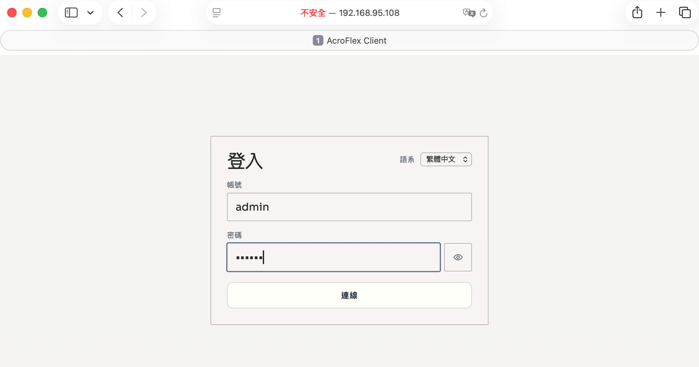

# 3.1. 登入 AcroFlex Client 管理系統

AcroFlex Client 是 AcroFlex 超融合系統的管理介面。本節說明如何依使用者與 AcroVMS 的網路位置，選擇正確的連線網址並完成登入。

## 前置條件

- 若管理電腦與 AcroVMS 位於同一個防火牆的同一個網段，使用建立 AcroFlex 系統時設定的 AcroVMS 內部 IP 位址。例如：`https://192.168.95.108`。
- 若管理電腦與 AcroVMS 不在同一個防火牆的同一個網段，或需要從網際網路登入，使用 AcroVMS 的外部 IP 位址。例如：`https://59.130.154.11`。
- 準備有效的管理帳號。預設帳號為 `admin`。
- 準備管理密碼。預設密碼為 `000000`；首次登入後建議立即修改。
- 確認 AcroVMS 已完成啟動，且管理電腦可以連線到適用的內部或外部 IP 位址。

## 登入畫面說明

開始操作前，先查看 AcroFlex Client 的登入畫面。畫面會提供帳號與密碼輸入欄位，以及送出登入要求的按鈕。請依實際畫面確認欄位名稱；下圖為本節使用的登入畫面素材。

圖 3.1-1　AcroFlex Client 登入畫面。實際連線網址、帳號與畫面內容可能依系統版本及部署環境而不同。

## 登入步驟

1. 先判斷管理電腦與 AcroVMS 的網路位置：
   - 同一個防火牆、同一個網段：使用 AcroVMS 內部 IP 位址，例如 `https://192.168.95.108`。
   - 不同防火牆或不同網段，或從網際網路登入：使用 AcroVMS 外部 IP 位址，例如 `https://59.130.154.11`。
2. 確認管理電腦可以連線到所選的 AcroVMS IP 位址。若無法連線，先檢查網路路由、防火牆規則、IP 位址與服務狀態。
3. 開啟瀏覽器，在網址列輸入適用的 HTTPS 管理網址，然後連線。
4. 在 AcroFlex Client 登入畫面輸入帳號。若仍使用預設帳號，輸入 `admin`。
5. 輸入密碼。若尚未修改預設密碼，輸入 `000000`。
6. 按一下登入按鈕，等待 AcroFlex Client 完成驗證。
7. 成功登入後，確認已進入 AcroFlex 管理介面，並檢查主機雲與系統狀態是否正常。

## 注意事項與限制

- 請使用 `https://` 存取 AcroFlex Client，並在受信任的管理網路中進行管理操作。
- 外部 IP 僅能在防火牆或 IP 分享器已正確設定轉送、存取控制與必要服務埠號時使用；不要為了登入而任意開放管理服務。
- 首次登入後，請立即修改 `admin` 的預設密碼，並使用符合組織資安政策的密碼。
- 請勿將帳號、密碼或外部 IP 設定公開於文件、截圖或不受控的通訊頻道。
- 若瀏覽器顯示憑證警告，請先確認網址與網路環境確實正確，再依組織的憑證政策處理；不要在未知網址上直接輸入管理帳密。
- 若登入失敗，依序檢查所使用的 IP 類型、網路連線、防火牆規則、 AcroVMS 服務狀態與帳密是否正確。

## 素材對照

- 圖片：`assets/images/`
- 螢幕快照：`assets/screenshots/Infra_Login.png`
