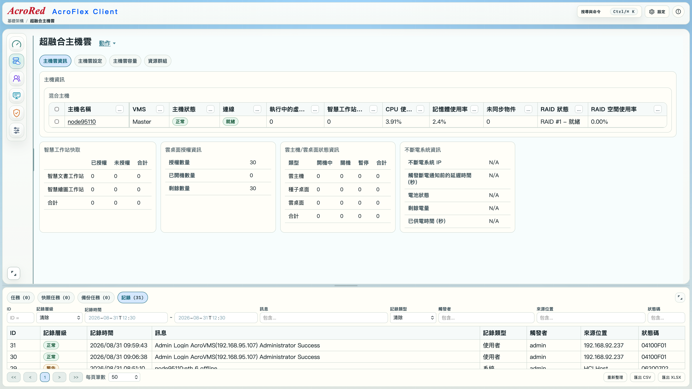

# 3.2. AcroFlex Client 管理系統的介面與功能介紹

AcroFlex Client 是 AcroFlex 超融合系統的集中管理介面。使用者登入後，可以從同一個管理畫面檢視系統狀態、管理超融合主機、管理使用者與雲主機／雲桌面，並執行資料保全及其他系統設定工作。

本節以 AcroFlex Client 主畫面為基礎，說明各區域的用途、功能之間的關係，以及使用者從功能選擇到完成操作時的基本邏輯。

## 前置條件

- 已完成 AcroFlex VMS 的啟動與基本設定。
- 已成功登入 AcroFlex Client。
- 使用者具有與工作內容相符的管理權限。
- 若要執行會變更系統的操作，應先確認目前沒有衝突中的任務、維護作業或未完成的設定。
- 若要檢視主機、虛擬機器或儲存狀態，應確認相關主機與服務已完成啟動。

## 主畫面總覽

下圖是 AcroFlex Client 的主畫面。閱讀畫面時，可先按照「由上到下」辨識三個主要區域，再按照「由左到右」辨識中央管理區中的三個欄位。

圖 3.2-1　AcroFlex Client 主畫面。實際顯示的功能、名稱、狀態與可操作項目，會依系統版本、使用者權限及目前主機組態而不同。

### 由上到下的三個主要區域

| 區域 | 位置 | 主要用途 |
| --- | --- | --- |
| 標題列 | 畫面最上方 | 提供 AcroFlex Client 的導覽、功能搜尋、系統設定，以及資訊中心入口。 |
| 資訊和操作區 | 標題列下方的主要工作區 | 顯示 AcroFlex 系統資訊，並依目前選取的功能提供檢視、設定與管理操作。 |
| 任務和記錄區 | 畫面最下方 | 顯示正在執行或已提交的任務，以及系統操作與事件記錄；此區域可以隱藏。 |

這三個區域的功能彼此相關：

1. 使用者先在標題列或左側功能區選擇要處理的工作。
2. 資訊和操作區依選擇的主功能與子功能更新內容。
3. 執行會花費時間或需要背景處理的操作後，在任務和記錄區確認進度與結果。
4. 若操作失敗，先查看任務狀態與系統記錄，再回到資訊和操作區檢查設定。

### 資訊和操作區的三個欄位

在中間的資訊和操作區中，由左到右可再分成三個欄位：

| 欄位 | 位置 | 主要用途 |
| --- | --- | --- |
| 主功能區域 | 最左側 | 選擇 AcroFlex Client 的主要管理類別。 |
| 子功能區域 | 主功能區域右側 | 顯示目前主功能下的細部功能或頁籤；此區域可以隱藏。 |
| 資訊顯示區和操作區 | 最右側、面積最大的區域 | 顯示詳細資訊、表格、狀態、設定欄位與操作按鈕。 |

因此，使用者通常要依照「主功能 → 子功能 → 詳細資訊／操作」的順序使用介面。只直接查看最右側的內容，可能會忽略目前內容所屬的功能類別與操作範圍。

## 一、標題列

標題列是 AcroFlex Client 的全域操作區。無論目前正在檢視哪一個管理功能，標題列都提供跨功能使用的入口。

### 1. AcroFlex Client 導覽列

導覽列用於辨識目前所在的管理系統，並協助使用者在不同的管理功能之間移動。使用者從主功能區選擇管理類別後，導覽列與主要工作區會配合更新。

使用導覽列時，應注意：

- 先確認目前登入的系統確實是預期的 AcroFlex 環境。
- 切換功能前，確認目前頁面沒有尚未儲存的輸入內容。
- 若正在執行建立、更新、移除或韌體相關任務，不要因為切換頁面就假設任務已經完成。
- 目前頁面所屬的主功能與子功能，應與操作目標一致。

### 2. 功能搜尋

功能搜尋用於快速尋找 AcroFlex Client 中可用的管理功能或相關頁面。當系統功能較多，或使用者不確定某項操作位於哪個主功能下時，可以先使用搜尋，再由搜尋結果進入對應頁面。

建議的使用方式如下：

1. 在功能搜尋欄輸入功能名稱或關鍵字。
2. 查看搜尋結果所屬的主功能與子功能。
3. 開啟最符合目的的結果。
4. 進入頁面後，再確認頁面標題、管理對象或目標資源是否正確。

搜尋只能協助找到功能入口，不能取代操作前的權限、資源狀態與影響範圍確認。

### 3. 系統設定入口

系統設定入口用於開啟 AcroFlex Client 或 AcroFlex 系統相關的設定功能。設定內容可能影響管理連線、系統行為、服務或其他使用者，因此執行前應先確認：

- 設定的對象是 AcroFlex 系統、主機，還是目前登入的管理介面。
- 設定是否需要重新啟動服務或主機。
- 設定是否會造成管理連線中斷。
- 目前帳號是否具有足夠權限。
- 是否已記錄變更前的設定值。

### 4. 資訊中心

資訊中心提供線上說明書與 API 使用手冊等參考資料入口。使用者可以在不離開管理介面的情況下查閱功能說明、操作規則與介面整合資訊。

資訊中心適合用於：

- 確認某個功能的定義與使用範圍。
- 查閱操作前置條件與限制。
- 查找 API 的用途、參數或整合方式。
- 比對目前系統版本所支援的功能。

資訊中心的說明是操作參考；實際可用功能仍以目前系統版本、授權狀態與使用者權限為準。

## 二、主功能區域

主功能區域位於資訊和操作區的最左側，提供六個主要功能類別。使用者先從這裡選擇管理方向，系統再在旁邊顯示相應的子功能。

### 六個主功能

| 順序 | 主功能 | 管理範圍 |
| --- | --- | --- |
| 1 | 系統儀表板 | 以總覽方式查看系統整體狀態、重要資源與需要注意的資訊。 |
| 2 | 主機雲基礎架構管理 | 管理 AcroFlex 主機雲、超融合主機、主機角色、主機配對與基礎架構狀態。 |
| 3 | 使用者管理 | 管理使用者帳號、登入資訊、角色與可執行的權限範圍。 |
| 4 | 雲主機／雲桌面管理 | 管理雲主機、虛擬機器、雲桌面與相關工作負載。 |
| 5 | 資料保全管理 | 管理資料保護、備份、還原或其他確保資料可用性的功能。 |
| 6 | 其他 | 放置不屬於前述主要類別的系統功能與輔助設定。 |

主功能的選擇會決定子功能區域所顯示的內容。不同主功能之間的資料可能互相影響，例如主機雲狀態會影響雲主機可使用的運算資源，使用者權限則會影響可見的管理頁面與可按下的操作按鈕。

### 1. 系統儀表板

系統儀表板是快速掌握 AcroFlex 系統狀態的入口。它適合在登入後先查看，也適合在完成重要管理工作後回到此處進行總體確認。

查看儀表板時，應依序注意：

- 系統是否處於正常、警告或異常狀態。
- 是否有離線、故障、維護中或尚未完成初始化的主機。
- 是否有等待處理、失敗或持續執行中的任務。
- 儲存、運算、網路或服務是否出現需要處理的訊息。

儀表板是總覽頁面，不一定包含所有詳細資訊。發現異常時，應由儀表板的提示進入對應主功能，再查看詳細狀態與記錄。

### 2. 主機雲基礎架構管理

此主功能用於管理構成 AcroFlex 系統的超融合主機與主機雲。常見管理工作包括：

- 查看超融合主機雲的整體狀態。
- 查看混合主機、運算主機與儲存主機的角色與狀態。
- 增加容錯主機或建立主機配對。
- 定位實體超融合主機。
- 將混合主機與儲存主機進行角色轉換。
- 增加或移除運算主機。
- 將主機切換為 VMS 執行主機、維護模式或正常模式。
- 管理超融合主機與相關工作站的韌體。

這類操作通常會影響主機雲拓撲、儲存鏡像、虛擬機器執行位置或管理服務。執行前必須先確認主機角色、配對狀態、工作負載與任務狀態。

### 3. 使用者管理

使用者管理用於控制誰可以登入 AcroFlex Client，以及登入後可以查看或執行哪些工作。

使用者管理的基本操作邏輯是：

1. 建立或選擇使用者帳號。
2. 指派適當的角色或權限。
3. 確認使用者可存取的管理範圍。
4. 由使用者登入後測試實際可見頁面與可用操作。
5. 在人員異動或權限需求改變時，及時停用、刪除或調整帳號。

權限設定應依最小權限原則辦理。不要因為操作方便而將所有帳號都授予完整管理權限。

### 4. 雲主機／雲桌面管理

此主功能用於管理提供給使用者使用的雲主機、虛擬機器與雲桌面。其資訊與操作可能包含：

- 查看雲主機或雲桌面的清單與目前狀態。
- 建立、啟動、停止、重新啟動或刪除虛擬機器。
- 管理虛擬機器的運算、記憶體、儲存與網路配置。
- 查看虛擬機器目前所在的超融合主機。
- 將工作負載安排至可用的運算資源。
- 管理雲桌面使用者的連線與服務狀態。

執行虛擬機器相關操作前，應確認是否有使用者正在使用、是否有未儲存資料，以及操作是否會造成服務中斷。

### 5. 資料保全管理

資料保全管理用於降低資料遺失與服務中斷風險。實際功能依系統版本與部署內容而異，使用者應由子功能區確認可用的備份、還原或保護功能。

進入此主功能後，應先確認：

- 保護的對象是整個系統、主機、儲存資源、雲主機還是雲桌面。
- 備份目的地與保留策略是否正確。
- 最近一次備份是否成功。
- 還原操作會覆寫哪些資料。
- 還原前是否需要停止相關工作負載。

資料保全相關任務通常需要較長時間，應透過任務和記錄區確認實際執行結果。

### 6. 其他

其他主功能提供未歸入上述五個類別的功能與輔助設定。使用前應先閱讀頁面說明，確認該功能的管理對象與影響範圍。

若不確定某個功能的用途，建議先使用標題列的功能搜尋、查看資訊中心中的線上說明，並由唯讀狀態頁面開始，不要直接變更設定。

## 三、子功能區域

子功能區域位於主功能區域右側。它會根據目前選取的主功能，列出該類別下可用的細部功能。

子功能區域的主要作用是縮小管理範圍。例如選取「主機雲基礎架構管理」後，子功能可能分成主機雲總覽、主機管理、主機角色、韌體或其他基礎架構功能。選取「雲主機／雲桌面管理」後，則可能分成雲主機、雲桌面、映像檔、資源或連線相關功能。

### 子功能的使用方式

1. 先在主功能區域選取管理類別。
2. 在子功能區域選擇細部頁面。
3. 確認右側資訊顯示區的標題與管理對象。
4. 依頁面提供的檢視或操作功能進行處理。
5. 完成後查看任務和記錄區，再回到狀態頁面確認結果。

子功能區域可以被隱藏。隱藏後，最右側的資訊顯示區會有較大的可用寬度，適合查看寬表格、詳細資訊或操作結果；但隱藏子功能後，使用者仍應記得目前頁面所屬的主功能與操作範圍。

## 四、資訊顯示區和操作區

資訊顯示區和操作區位於畫面最右側，通常也是畫面面積最大的部分。它會依主功能與子功能顯示不同內容，是使用者檢視資料與執行操作的主要工作區。

### 右側工作區常見內容

- 頁面標題與目前功能位置。
- 主機、主機雲、虛擬機器、使用者或任務的清單。
- 系統狀態、連線狀態、角色與健康資訊。
- CPU、記憶體、儲存與網路等資源資訊。
- 設定欄位、下拉選單、核取方塊與輸入欄位。
- 建立、修改、刪除、啟用、停用、維護或韌體相關按鈕。
- 重新整理、檢視詳細資訊、定位或其他輔助操作。

### 閱讀右側工作區的順序

1. **確認頁面標題：** 確認目前是在主機、虛擬機器、使用者、備份或其他正確功能中。
2. **確認操作對象：** 查看主機名稱、IP、序號、虛擬機器名稱、使用者名稱或任務編號。
3. **確認目前狀態：** 例如正常、離線、維護中、執行中、失敗或尚未完成。
4. **確認可用操作：** 注意按鈕是否停用，以及系統是否顯示限制或警告。
5. **執行操作：** 輸入設定或按下操作按鈕前，再次核對目標。
6. **確認結果：** 查看頁面狀態是否更新，並到任務和記錄區檢查作業結果。

### 檢視與變更的差異

資訊顯示區同時支援「檢視」與「變更」兩類工作。檢視工作主要是讀取狀態、資源與記錄，通常不會改變系統；變更工作則會寫入設定、建立或移除資源、切換主機角色，或啟動背景任務。

使用者應先完成檢視，再執行變更。尤其是刪除、移除、轉換角色、切換模式、韌體更新與還原資料等操作，必須先確認警告內容與影響範圍。

## 五、任務和記錄區

任務和記錄區位於畫面最下方，用來顯示管理操作的執行狀態與系統紀錄。此區域可以隱藏，但在執行背景任務或排除問題時不應忽略。

### 任務狀態

任務區可用來追蹤需要時間處理的工作，例如建立或移除資源、主機加入或配對、角色轉換、韌體上傳與更新、備份、還原或需要等待服務同步完成的操作。

看到操作按鈕已按下，不代表作業已完成。應等待任務顯示成功、完成或相當的終止狀態，再進行下一個相依操作。

### 記錄內容

記錄區可協助了解：

- 哪一個帳號執行了操作。
- 操作發生的時間。
- 操作的對象與功能。
- 操作成功、失敗或被取消的結果。
- 系統或服務回報的警告與錯誤訊息。

發生問題時，應保留任務編號、時間、操作對象與完整錯誤訊息，方便後續分析或聯絡技術支援。

### 隱藏與顯示

任務和記錄區可以被隱藏，以增加主要資訊區的可視範圍。隱藏不會停止任務，也不會刪除記錄；它只改變畫面呈現方式。

在執行建立、更新、移除、備份、還原或韌體作業後，應重新顯示此區域確認進度與結果。

## 六、AcroFlex Client 的基本操作邏輯

AcroFlex Client 的操作可以整理成下列流程：

1. **登入：** 使用正確的內部或外部 IP 登入 AcroFlex Client。
2. **選擇主功能：** 依工作目的選擇系統儀表板、主機雲基礎架構、使用者、雲主機／雲桌面、資料保全或其他。
3. **選擇子功能：** 在子功能區域縮小管理範圍。
4. **辨識頁面與對象：** 在右側工作區確認標題、資源名稱、角色、狀態與目前設定。
5. **先檢查再操作：** 確認前置條件、權限、工作負載、網路與儲存狀態。
6. **執行操作：** 依畫面提示輸入資料、選取資源或按下操作按鈕。
7. **追蹤任務：** 在最下方任務區確認作業進度與結果。
8. **驗證結果：** 回到相關狀態頁面，確認設定已套用、資源狀態正常且服務可用。
9. **保留記錄：** 對重要變更記錄時間、操作者、目標、變更內容與任務結果。

這個流程的重點是「選擇功能」與「確認操作對象」必須分開處理。即使頁面顯示的按鈕可用，也不代表目前選取的主機、虛擬機器或使用者就是預期目標。

## 七、系統狀態與訊息的判讀

目前系統狀態應從多個位置交叉判斷，不應只依一個圖示或單一文字判定：

- **儀表板：** 用於快速掌握整體系統是否有異常。
- **主機或資源頁面：** 用於確認特定主機、虛擬機器、儲存或網路的細節。
- **任務區：** 用於確認操作是否完成、仍在執行或已失敗。
- **記錄區：** 用於查看事件時間、操作者、錯誤原因與相關上下文。
- **頁面警告或提示：** 用於了解目前操作的限制與可能影響。

判讀時建議：

1. 先確認訊息所屬的資源與時間。
2. 區分目前狀態與歷史記錄；歷史錯誤不一定代表目前仍然故障。
3. 區分警告與操作失敗；警告表示需要注意，不一定表示作業未完成。
4. 若任務顯示成功，仍應回到資源頁面確認實際狀態。
5. 若不同區域顯示的狀態不一致，先等待頁面重新整理或任務同步完成，再進行判斷。
6. 若狀態持續異常，記錄完整訊息與任務編號，不要反覆提交相同操作。

實際狀態名稱、圖示與顏色可能依系統版本而異；判讀時應以畫面文字、任務結果與相關詳細資訊為準。

## 八、操作範例：由主功能進入詳細管理頁面

1. 登入 AcroFlex Client。
2. 從主功能區域選擇要管理的類別，例如「主機雲基礎架構管理」。
3. 在子功能區域選擇對應頁面，例如主機雲狀態或主機管理。
4. 在最右側工作區確認頁面標題與目標主機。
5. 先查看主機角色、連線、工作負載與任務狀態。
6. 若要執行變更，確認操作按鈕、警告訊息與權限要求。
7. 執行操作後，打開任務和記錄區確認進度。
8. 任務完成後重新整理或回到狀態頁面，確認結果已套用。

其他主功能也應遵循相同邏輯，只是管理對象會改為使用者、雲主機／雲桌面或資料保全資源。

## 注意事項與限制

- 實際功能會依 AcroFlex Client 的系統版本、授權狀態、使用者角色與主機組態而異。
- 本節圖片用於說明介面區域與操作邏輯；圖片中的示範名稱、IP、數值或狀態不可直接套用到其他環境。
- 執行會變更系統的操作前，應先確認目標資源、目前狀態、權限、工作負載與維護窗口。
- 任務尚未完成前，不要重複提交相同操作，也不要直接關閉主機或中斷網路。
- 主機角色轉換、主機配對、維護模式、韌體更新、備份與還原等工作，可能影響服務或資料可用性，應依各節操作說明執行。
- 具有管理權限不代表每個操作都適用於目前狀態；仍須遵守頁面顯示的前置條件與限制。
- 任務和記錄區可以隱藏，但隱藏不會停止任務。重要操作完成後，務必重新顯示並確認結果。
- 若畫面狀態、任務結果與記錄內容不一致，應先保留資訊並確認同步狀態，不要直接進行具破壞性的後續操作。
- 從網際網路存取 AcroFlex Client 時，必須搭配適當的 HTTPS 憑證、防火牆、存取控制與必要的安全政策。

## 素材對照

- 圖片：assets/images/
- 螢幕快照：assets/screenshots/infra_main_page_chinese.png
